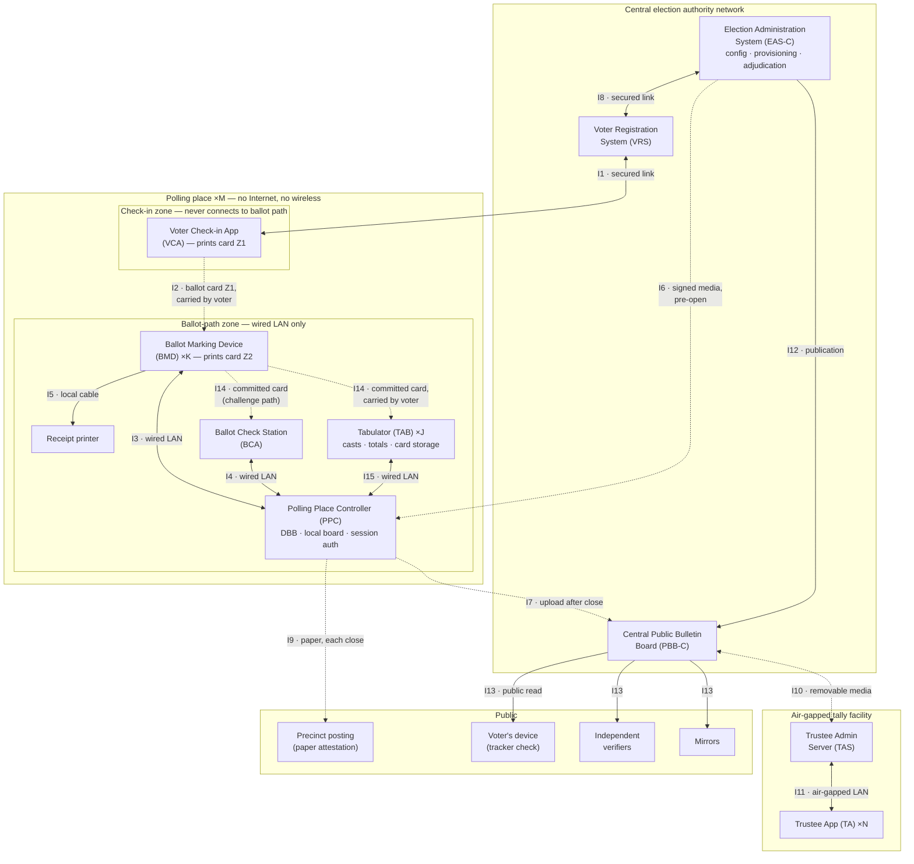

# On-Site E2E-V Architecture, BMVS Variant: Ballot-Marking Devices with Polling-Place Tabulators

**Date:** 2026-07-06
**Status:** Investigation / architecture blueprint (BMVS variant)
**Series:** [Feasibility Assessment](./onsite-e2ev-feasibility.md) →
[Feature Variation Points](./onsite-e2ev-feature-variations.md) →
[Crypto Kernel Primer](./onsite-e2ev-crypto-kernel.md) →
[Baseline Architecture](./onsite-e2ev-architecture.md) → this document

This document analyzes whether the on-site E2E-V architecture in
[onsite-e2ev-architecture.md](./onsite-e2ev-architecture.md) can accommodate a **Ballot Marking
Voting System (BMVS)** — the workflow exemplified by
[ES&S ExpressVote](https://www.essvote.com/products/expressvote-3/) ballot-marking devices paired
with a [DS300-class polling-place tabulator](https://www.essvote.com/products/ds300/) — while
preserving *provable* cast-as-intended, recorded-as-cast, and counted-as-recorded guarantees.

**Verdict: yes, with bounded, well-localized changes.** The cryptographic kernel (Naor-Yung
encryption, Joint-Feldman DKG, hash-chained bulletin board, Terelius-Wikström mix, threshold
decryption) is untouched. The changes are: one component is redefined (the Voting Application
becomes a **Ballot Marking Device** that prints on the voter's card), one component is added (the
**Tabulator**, which becomes the casting point), two interconnections are added (the marked card's
physical path, and the tabulator's LAN link), one flow relocates (ballot cast moves from the
voting machine to the tabulator), the separate VVPAT is absorbed into the ballot card, and one
product-line constraint (X6, on paper↔cryptogram linkage) is deliberately amended — a privacy
trade that BMVS makes inherently and that buys ballot-level auditability plus an automatic
cross-check between the paper tally and the cryptographic tally. Every change, and every place a
new protocol proof is required, is marked below.

This is a **standalone, comprehensive** document: it reproduces all unchanged material from the
baseline architecture and integrates the BMVS additions and changes in place. Flows are tagged
**[unchanged]**, **[BMVS-changed]**, or **[BMVS-new]**; flow numbering is kept aligned with the
baseline document so the two can be diffed side by side.

## The BMVS Model and Its Mapping onto the Architecture

The defining BMVS characteristics, and where each lands in this architecture:

| # | BMVS characteristic | Architectural realization |
|---|---|---|
| 1 | At check-in, the voter receives a ballot card encoding their ballot style | The F2.1 authorization card and the ballot card **unify into one physical object**: the Voter Check-in Application prints the authorization zone (Z1) on blank ballot-card stock |
| 2 | The voter inserts the card into any voting machine | F3.1 session activation, with the card physically ingested and held by the BMD for the session |
| 3 | Selections are made on the machine's screen | Unchanged ballot presentation (all baseline features: IRV, write-ins, languages, accessibility) |
| 4 | Committing the vote makes it unchangeable | **Commit = ballot submission (F3.2)**: the encrypted ballot is posted to the local bulletin board — the Benaloh commit point, now with a physical counterpart |
| 5 | The machine prints the selections on the card, human- and machine-readable | The BMD prints the selections zone (Z2): human-readable text plus a machine-readable encoding carrying the plaintext selections **and** the board tracker |
| 6 | The machine returns the completed card to the voter | The card, now a marked ballot, travels with the voter (new interconnection I14) |
| 7 | The vote is cast only when a Tabulator accepts the card | **Ballot cast relocates to the new Tabulator component (F15.1)**; the tabulator maintains running totals from the plaintext machine zone and stores cards for audit and recount |

The pivotal design insight: BMVS's "commit, then carry the paper to the casting device" structure
is *isomorphic* to the E2E-V "submit, then choose cast-or-check" structure. The commit step is the
cryptographic submission; the walk from BMD to tabulator is the cast-or-check decision window; the
tabulator is the caster; the check station is the challenge path. Nothing about the kernel needs
to move — only where casting is initiated, and what travels on paper.

### Three records, cross-checked

A BMVS-E2E-V ballot exists in three synchronized forms, each checkable against the others:

| Record | Readable by | Checked against voter intent by |
|---|---|---|
| Human-readable text (card Z2) | The voter, directly | The voter reading the card (BMVS's native strength) |
| Machine-readable plaintext (card Z2) | Tabulator, check station | Check-station scan-and-display (F4.2); post-election paper recount |
| Naor-Yung cryptogram (bulletin board) | Anyone (encrypted); trustees (jointly) | Benaloh challenge (F4.2); mix+decrypt transcript (F13.2) |

The machine-readable zone uses **the same fixed-width rank encoding** that is encrypted inside the
cryptogram, so "the barcode matches the electronic ballot" is a *byte-equality* check, not an
interpretation. This directly answers the standing criticism of barcode BMDs (voters cannot read
barcodes): here the barcode is verifiable against the cryptogram by anyone, machine-checked at the
check station, and reconciled in aggregate after the election — any BMD strategy of printing
honest text but dishonest barcode (or honest barcode but dishonest cryptogram) is caught by at
least one of: voter reading, check-station comparison, Benaloh challenge, or the mandatory
tally-reconciliation identity (§ Reconciliation).

## Delta Summary vs. the Baseline Architecture

| Kind | Item |
|---|---|
| **Added component** | Tabulator (TAB) — DS300-class: scans cards, validates against the board, initiates cast, keeps running totals, stores cards |
| **Changed component** | Voting Application → **Ballot Marking Device (BMD)**: same protocol role for activation/submission/challenge, plus card ingestion, Z2 printing, nonce voiding, card return |
| **Added interconnections** | I14 (marked card, BMD → voter → Tabulator *or* check station); I15 (Tabulator ↔ PPC, wired LAN) |
| **Relocated flow** | F3.3 (ballot cast) moves from I3 to I15 as F15.1, initiated by the Tabulator |
| **Removed flow** | F5.1 (separate VVPAT print) — the marked card *is* the voter-verifiable paper record |
| **Changed flows** | F2.1 (card = ballot card stock), F3.1 (physical card ingestion), F3.2 (commit adds Z2 printing + nonce voiding + card return), F4.1/F4.2 (card-scan challenge with three-way display), F6.1 (+ BMD/TAB keys), F7.1 (+ tabulator reports), F9.1 (+ totals hash, card counts), F10.1/F10.2 (+ reconciliation inputs/outputs), F13.2 (+ reconciliation check) |
| **Amended constraint** | X6 → **X6′**: ballot-level paper↔cryptogram linkage exists *by design* (tracker printed on the card); privacy shifts to custody controls, pseudonym one-wayness, and nonce destruction — see § Privacy |
| **Unchanged** | The entire cryptographic kernel and trustee ceremonies (I10, I11); check-in/registration flows (I1, I2 structure, I8); publication and verification structure (I7, I9, I12, I13); all baseline features (provisional ballots, early voting, free-text write-ins) |

## Assumed Product-Line Instance

Identical to the baseline document — full **Baseline** feature set plus **provisional ballots**,
**early voting**, and **free-text write-ins** — with one amendment: the signed election
configuration's instance descriptor carries a **BMVS-mode flag**, so verifiers, auditors, and the
assurance case know which casting model, and which constraint set (X6′ rather than X6), governs
this election. Parameters as before: `M` polling places, `K` BMDs per place, `N` trustees with
threshold `T`, plus `J` tabulators per place (typically 1–2).

## The Ballot Card Lifecycle

The single physical card is the system's only cross-gap message carrier, and it passes through
well-defined states. Its printable surface has two zones:

- **Z1 — authorization zone**, printed by the Voter Check-in Application at check-in:
  {`election_hash`, site ID, ballot style, activation nonce, validity window, provisional flag},
  Ed25519-signed by the VCA. Identical content to the baseline F2.1 card.
- **Z2 — selections zone**, printed by the BMD at commit: human-readable selections text, plus a
  machine-readable block {`election_hash`, ballot style, plaintext rank encoding (identical bytes
  to the encrypted plaintext, write-in field padded per constraint X5), **tracker**, voter
  pseudonym, BMD ID}, Ed25519-signed by the BMD. At the same moment, the BMD **voids Z1's
  activation nonce** (dense overprint/punch) so the nonce — the only value that could ever bridge
  the check-in journal to the ballot — is destroyed before the card carries vote content.

Card states: `blank stock` → `issued` (Z1 printed, F2.1) → `activated` (ingested by a BMD, F3.1)
→ `committed` (Z2 printed, nonce voided, returned to voter, F3.2) → exactly one of
`cast` (accepted by a tabulator, F15.1) | `spoiled` (challenged at the check station, F4.2, then
physically voided and surrendered) | `expired` (never presented; surfaces in reconciliation).
Every state transition leaves a signed record (VCA journal, board bulletin, or disposition), so
card accounting closes exactly at end of day.

## Component Inventory

| Component | Trust zone | Role | Key material held |
|---|---|---|---|
| Voter Check-in Application (**VCA**) | Polling place, check-in zone | Verify voter identity/eligibility, assign ballot style, print card Z1, keep check-in journal | VCA Ed25519 signing key; `election_hash` |
| Ballot Marking Device (**BMD**), ×K **[BMVS-changed]** | Polling place, ballot-path zone | Ingest card, present ballot, encode + encrypt selections, submit (commit), print Z2 + void nonce + return card, serve Benaloh challenges | Election public key; per-session ephemeral Ed25519 key pair; **BMD Ed25519 print-signing key**; per-ballot randomizers (held until cast/spoil/close) |
| Receipt printer (**PRN**) | Polling place, ballot-path zone (peripheral of each BMD) | Print take-home tracker receipts (VVPAT function absorbed by the card) | None |
| **Tabulator (TAB), ×J [BMVS-new]** | Polling place, ballot-path zone | Scan committed cards, validate against board, initiate cast, maintain running totals from plaintext zone, store cards in sealed box, end-of-day signed reports | TAB Ed25519 signing key; BMD/VCA verifying keys |
| Polling Place Controller (**PPC**) | Polling place, ballot-path zone | Digital Ballot Box + local bulletin board + session authorization; only ballot-path device with any external channel, and only after close | DBB Ed25519 signing key; session-authorization signing key; VCA/BMD/TAB verifying keys; consumed-nonce ledger |
| Ballot Check Station (**BCS**) | Polling place, ballot-path zone | Ballot Check Application for Benaloh challenges: scans committed cards, brokers randomizer disclosure, three-way display (with audio readback) | Per-check ephemeral ElGamal + Ed25519 key pairs |
| Voter Registration System (**VRS**) | Central authority network | Voter rolls, check-in status, participation records, provisional evidence | VRS signing key; roll data (never ballot data) |
| Election Administration System (**EAS-C**) | Central authority network | Election definition, device provisioning, L&A testing, provisional adjudication, dispositions | EA signing key; software-signing keys |
| Central Public Bulletin Board (**PBB-C**) | Central authority network, publicly readable | Aggregates site board segments and tabulator reports, publishes the election record and tally transcript | Publication signing key |
| Trustee Administration Server (**TAS**) | Air-gapped tally facility | Trustee message board; ferries data across the air gap via media | TAS Ed25519 signing key |
| Trustee Application (**TA**), ×N | Air-gapped tally facility | Setup endorsement, DKG, mixing, decryption | Trustee Ed25519 signing key; trustee ElGamal encryption key pair; private key share (post-DKG) |
| Independent verifiers, mirrors, voters' devices | Public | Re-verify the published record (now including the reconciliation identity); detect equivocation; tracker checks | Public keys only |

## Architectural Diagram

Solid edges are wired electronic links (no wireless, no Internet, anywhere in the ballot path,
ever). Dashed edges are physical transfers (printed paper, the ballot card, or removable media
carried by people) or links permitted **only after polls close**.



**Isolation rules embodied in the diagram.** BMDs have exactly three connections: the wired LAN to
the PPC, a local printer cable, and the card slot — never anything else. The Tabulator has exactly
two: the wired LAN to the PPC and its card feed. The PPC has no external connectivity while polls
are open; `I7` activates only after close. The VCA is never connected to any ballot-path device;
the ballot card (`I2`, then `I14`) is the only information path across that gap and between the
BMD and the casting/challenge devices — carried by the voter in both legs. The VCA's secured link
to the VRS (`I1`) is permissible because the check-in zone handles no ballot data; jurisdictions
preferring a fully offline check-in operate `I1` in batch mode, at the cost of same-day cross-site
double-check-in prevention during early voting. The tally facility touches the world only through
removable media (`I10`).

## Interconnection Index

| ID | Endpoints | Channel | Active | Flows |
|---|---|---|---|---|
| I1 | VCA ↔ VRS | Secured network link (outside ballot path) | Pre-open, open, post-close | F1.1 provisioning, F1.2 check-in sync, F1.3 reconciliation — **[unchanged]** |
| I2 | VCA → BMD | Ballot card (Z1), carried by voter | Polls open | F2.1 ballot-style authorization — **[BMVS-changed]** |
| I3 | BMD ↔ PPC | Wired polling-place LAN | Polls open | F3.1 session activation **[BMVS-changed]**, F3.2 commit/submission **[BMVS-changed]**, F3.4 forwarded check request **[unchanged]**, F3.5 randomizer transmission **[unchanged]** — *F3.3 relocated to F15.1* |
| I4 | BCS ↔ PPC | Wired polling-place LAN | Polls open | F4.1 check request **[BMVS-changed]**, F4.2 randomizer delivery + three-way display **[BMVS-changed]** |
| I5 | BMD → PRN | Local printer cable | Polls open | F5.2 tracker receipt **[unchanged]** — *F5.1 (VVPAT) removed: the card is the paper record* |
| I6 | EAS-C → PPC/BMD/BCS/TAB | Signed removable media (or supervised one-time wired) | Pre-open only | F6.1 configuration provisioning **[BMVS-changed]**, F6.2 L&A test session **[BMVS-changed]** |
| I7 | PPC → PBB-C | Secure network or physical media | After each daily close; final close | F7.1 board segment + tabulator report upload **[BMVS-changed]** |
| I8 | EAS-C ↔ VRS | Central secured network | Setup; post-close | F8.1 eligibility snapshot, F8.2 provisional adjudication — **[unchanged]** |
| I9 | PPC → precinct posting | Printed paper, publicly posted | Each daily close; final close | F9.1 chain-head attestation **[BMVS-changed]** |
| I10 | PBB-C ↔ TAS | Removable media across the air gap | Post final close | F10.1 tally input import **[BMVS-changed]**, F10.2 tally transcript export **[BMVS-changed]** |
| I11 | TAS ↔ TA | Air-gapped wired LAN | Pre-open (setup, DKG); post-close (mix, decrypt) | F11.1–F11.4 — **[unchanged]** |
| I12 | EAS-C → PBB-C | Central secured network | Pre-open; post-close | F12.1 config publication **[unchanged]**, F12.2 disposition publication **[unchanged]** |
| I13 | PBB-C → public | Public read access | Post final close (config from pre-open) | F13.1 tracker lookup **[unchanged]**, F13.2 full verification **[BMVS-changed]**, F13.3 mirroring **[unchanged]** |
| **I14** | BMD → voter → TAB *or* BCS | **Committed ballot card (physical)** | Polls open | F14.1 marked-card conveyance — **[BMVS-new]** |
| **I15** | TAB ↔ PPC | **Wired polling-place LAN** | Polls open; close-out | F15.1 card cast, F15.2 end-of-day totals & card report — **[BMVS-new]** |

Cryptographic algorithm names as in the baseline document (Ristretto255 context; Ed25519; ElGamal
`EVS` 11.15; Naor-Yung `EVS` 11.31 with plaintext-equality proof `EVS` 10.8; Joint-Feldman DKG
`EVS` 16.20; Terelius-Wikström `EVS` 12.3; Chaum-Pedersen `EVS` 10.3; SHA-3/SHA-512-family
hashing; OS CSPRNG). Structures marked **†** are new subprotocol elements; unmarked structures
reuse the existing VoteSecure [protocol specs](./protocol/specs/).

---

## I1: Voter Check-in Application ↔ Voter Registration System — [unchanged]

### F1.1 — Check-in provisioning (pre-open)

1. **What it does:** loads each VCA with its site's certified voter-roll extract, ballot-style
   assignments, early-voting validity calendar, and the signed election configuration hash.
2. **Initiator:** election officials, via the VRS.
3. **Pre-conditions:** trustee-endorsed election configuration exists (F11.1) and is published
   (F12.1); rolls certified; VCA device imaged with attested software.
4. **Inputs → outputs:** roll extract, style map, calendar, `election_hash` → provisioned VCA;
   provisioning receipt (bundle hash) logged in the VRS.
5. **Cryptography:** EA Ed25519 signature over the provisioning bundle (VCA verifies before
   accepting); VCA Ed25519 signing key generated on-device, its verifying key registered with the
   VRS and delivered to the EAS-C for inclusion in device provisioning (F6.1); SHA-3
   `election_hash` binds the bundle to this election.
6. **Post-conditions:** *success* — VCA operational for its site and dates; *failure* (signature
   or hash mismatch) — device rejected, not placed in service.

### F1.2 — Check-in status synchronization (polls open)

1. **What it does:** records each voter's check-in (regular or provisional) centrally, in near
   real time, so no voter can check in twice — at this site or any other — during multi-day early
   voting.
2. **Initiator:** VCA, on each completed check-in.
3. **Pre-conditions:** F1.1 done; voter identity verified per local procedure; link available
   (offline fallback: entries queue locally and reconcile via F1.3, with conflicts resolved to the
   provisional path).
4. **Inputs → outputs:** check-in record {voter record ID, site, timestamp, status
   regular/provisional, SHA-3 commitment to the issued card's activation nonce} → acknowledgment;
   central status updated (voter blocked from further regular check-ins).
5. **Cryptography:** Ed25519 signature by the VCA key over each record; SHA-3 nonce commitment
   (the nonce itself never leaves the polling place except sealed for provisional voters, F8.2 —
   and is physically destroyed on the card at commit, see F3.2); transport security on the secured
   link (outside protocol scope).
6. **Post-conditions:** *success* — voter marked checked-in everywhere; *offline* — queued with
   deferred reconciliation; *conflict detected* — later check-in refused or routed provisional.

### F1.3 — Post-close reconciliation and participation records (each daily close; final close)

1. **What it does:** uploads the complete signed check-in journal; reconciles cards issued against
   check-ins recorded; produces participation records (derived from check-in only — constraint
   X10 — never from bulletin-board contents).
2. **Initiator:** poll workers during close-out.
3. **Pre-conditions:** site closed for the day/election; VCA journal intact.
4. **Inputs → outputs:** hash-chained, signed check-in journal (including card reissue log) →
   reconciled central roll status; participation records; discrepancy report (cards issued vs.
   checked-in vs. — after F7.1 — cast bulletins and tabulator card counts, batch level only).
5. **Cryptography:** Ed25519 signatures on journal entries; SHA-3 chaining of the journal.
6. **Post-conditions:** *reconciled* — turnout/participation reporting available; *discrepancy* —
   incident procedure; provisional records staged for adjudication (F8.2).

## I2: Voter Check-in Application → Ballot Marking Device (ballot card Z1) — [BMVS-changed]

### F2.1 — Ballot-style authorization on the ballot card

1. **What it does:** conveys a single-use, ballot-style-scoped voting authorization across the
   mandated isolation gap between check-in and the ballot path — printed as **zone Z1 of the
   ballot card itself**, the same physical card the BMD will later mark (BMVS characteristic 1).
   The voter is the transport, and may use **any** BMD at the site.
2. **Initiator:** VCA, printing automatically on successful check-in.
3. **Pre-conditions:** voter checked in (F1.2, or queued offline); ballot style determined; PPC
   already holds this VCA's verifying key (F6.1); blank ballot-card stock loaded (controlled
   stock: counted, serialized rolls, reconciled at close like paper-ballot stock).
4. **Inputs → outputs:** Z1 fields {`election_hash`, site ID, ballot style, activation nonce,
   validity window (the early-voting day), provisional flag} → printed Z1 (machine-readable +
   human-readable summary); `CardAuthorization`† record retained in the VCA journal.
5. **Cryptography:** 128-bit activation nonce from the CSPRNG (unguessable, single-use); Ed25519
   signature by the VCA key over all Z1 fields (verified offline by the BMD/PPC against
   pre-provisioned keys — no live VCA link exists or is needed); SHA-3 hash of Z1 as the card ID
   in journals. **Deliberately absent:** any voter identity — the card carries style + nonce,
   never a name.
6. **Post-conditions:** *success* — voter holds a card that is both their voting credential and
   their future ballot; *card expires unredeemed* — void, visible in reconciliation (F1.3);
   *card lost before commit* — poll-worker-authorized reissue with a fresh nonce, logged and
   reconciled; *card lost after commit* — see F14.1 post-conditions.

## I3: Ballot Marking Device ↔ Polling Place Controller (wired LAN)

### F3.1 — Session activation† — [BMVS-changed]

1. **What it does:** converts a valid card into an authorized voting session bound to a fresh
   session key pair and a pseudonym, unlocking the correct ballot style on this BMD. The BMD
   **physically ingests and holds the card** for the session (BMVS characteristic 2), preventing
   mid-session card walk-off and guaranteeing Z2 is printed on the same card that authorized the
   session.
2. **Initiator:** BMD, when the voter inserts their card.
3. **Pre-conditions:** F6.1 provisioning (PPC holds VCA verifying keys and configuration); card
   Z1 signature valid and Z2 blank (a card already bearing Z2 is refused — it is a committed
   ballot, not a credential); card window matches today; polls open.
4. **Inputs → outputs:** `SessionActivationMsg`† {`election_hash`, Z1 `CardAuthorization`†, fresh
   session verifying key}, signed by the session signing key → `SessionAuthMsg`†
   {`election_hash`, voter pseudonym, session verifying key, ballot style, provisional flag},
   signed by the PPC's session-authorization key; retained by the PPC for later submission/cast
   validation and returned to the BMD.
5. **Cryptography:** BMD generates an ephemeral Ed25519 session key pair (CSPRNG); PPC verifies
   the Z1 Ed25519 signature against its provisioned VCA verifying keys, checks the activation
   nonce against its consumed-nonce ledger, and derives the pseudonym as
   SHA-3(`activation nonce` ‖ `election_hash`) — one-way, so the published board can never be
   linked back to a nonce or a voter; PPC signs the authorization (Ed25519).
6. **Post-conditions:** *success* — session active, nonce marked consumed, ballot presented in the
   designated style (write-in entry fields enabled where the style allows; all accessibility
   modes available); *rejections* (unknown VCA key / spent nonce / wrong window or site / Z2
   already present / bad signature) — card ejected, distinct error surfaced to poll workers, no
   state consumed except an audit log entry; *machine failure mid-session before commit* —
   poll-worker-authorized void-and-reissue, logged and reconciled.

### F3.2 — Commit: ballot submission + card marking — [BMVS-changed]

*Cryptographic core unchanged from the
[ballot submission spec](./protocol/specs/ballot-submission-spec.md); printing and card handling
added. This flow realizes BMVS characteristics 4, 5, and 6 in one atomic sequence.*

1. **What it does:** irrevocably commits the ballot: posts the encrypted ballot to the local board
   (the Benaloh commit — the BMD cannot later change anything, because the cryptogram is on the
   chained board *and* the plaintext is printed on paper in the voter's hands), then prints Z2 on
   the card, voids the Z1 nonce, and returns the card.
2. **Initiator:** BMD, when the voter presses **Commit** after reviewing the on-screen summary.
3. **Pre-conditions:** active session (F3.1); selections complete (including any free-text
   write-ins); voter has confirmed the review screen.
4. **Inputs → outputs:** `SignedBallotMsg` {`election_hash`, pseudonym, session verifying key,
   ballot style, ballot cryptogram} with session-key signature → `BallotSubBulletin` appended to
   the chained board (provisional flag† carried when set) and `TrackerMsg` {`election_hash`,
   tracker, result} signed by the DBB key; **then** the BMD prints Z2 = {human-readable selections
   text; machine-readable block: `election_hash`, style, plaintext rank encoding, tracker,
   pseudonym, BMD ID, Z2 signature}, overprints/punches the Z1 nonce, ejects the card to the
   voter, and prints the take-home tracker receipt (F5.2).
5. **Cryptography:** ballot encoding is the fixed-width padded rank encoding — the write-in text
   field is a fixed-length padded slot so every ciphertext *and every Z2 machine block* of a given
   style is shape-identical (constraint X5); Naor-Yung encryption of the encoded ballot under the
   election public key (2× ElGamal over Ristretto255 + plaintext-equality proof), randomizers from
   the CSPRNG, **retained by the BMD keyed by tracker** until cast/spoil/close; Ed25519 session
   signature over the message data; PPC verifies session authorization, signature, NY proof, and
   duplicate/style checks; board append computes the SHA-3 chain hash and DBB Ed25519 signature;
   tracker = hash of the bulletin entry; **Z2 machine block carries the *same rank-encoding bytes*
   that were encrypted** (making barcode↔cryptogram consistency a byte-equality check), and is
   Ed25519-signed by the BMD's print-signing key — the tabulator's basis for rejecting forged or
   hand-crafted cards.
6. **Post-conditions:** *success* — commit is irrevocable (BMVS characteristic 4) with three
   synchronized records (text, machine block, board cryptogram); the voter holds the marked card
   (characteristic 6) and the tracker receipt, and now chooses: cast at a tabulator (F15.1) or
   challenge at the check station (F4.1); *submission rejected* (invalid proof/signature,
   duplicate, style mismatch) — nothing printed, nothing appended, card remains activated, voter
   assisted; *print failure after board append* — card jam/misprint procedure: card voided and
   surrendered, board entry spoiled by disposition†, poll-worker reissue; the board entry and
   disposition keep the accounting exact.

### F3.3 — *Relocated.* Ballot cast is no longer initiated by the voting machine

In the BMVS variant, no cast request ever originates from the BMD. Casting is initiated by the
Tabulator when it accepts the physical card — see **F15.1**. (BMVS characteristic 7: "votes are
only cast when a tabulator accepts a ballot card.") The
[ballot cast spec](./protocol/specs/ballot-cast-spec.md)'s board rules — most-recent submission,
exactly one cast per pseudonym, matching keys — are enforced unchanged by the PPC; only the
initiating actor and its authentication change. **New proof required** (see § Proof Obligations).

### F3.4 — Forwarded check request — [unchanged]

1. **What it does:** relays a vetted check-station request to the BMD that holds the randomizers;
   begins mutual authentication-by-comparison between the two devices, through the voter's eyes.
2. **Initiator:** PPC, after validating F4.1.
3. **Pre-conditions:** submission exists and is uncast/unspoiled; the originating BMD still holds
   the randomizers for this tracker.
4. **Inputs → outputs:** `FwdCheckReqMsg` {`election_hash`, embedded `CheckReqMsg`} signed by the
   DBB key → BMD displays the check station's public-key fingerprint for the voter (or a poll
   worker assisting) to compare with the one the check station shows.
5. **Cryptography:** Ed25519 verification of the DBB signature (BMD); fingerprint = short SHA-3
   rendering of the BCA's ephemeral public key.
6. **Post-conditions:** *fingerprints match (confirmed)* — proceed to F3.5; *mismatch or timeout*
   — abort, incident log, ballot remains committed-uncast.

### F3.5 — Randomizer transmission — [unchanged]

1. **What it does:** confidentially delivers the encryption randomizers to the check station so it
   can independently reproduce the encryption and open the commitment.
2. **Initiator:** BMD, after fingerprint confirmation.
3. **Pre-conditions:** F3.4 confirmed.
4. **Inputs → outputs:** randomizer message: the ballot's randomizers encrypted to the BCA's
   ephemeral public encryption key, signed by the session key → relayed by the PPC to the BCS
   (F4.2).
5. **Cryptography:** ElGamal/Naor-Yung encryption of the randomizer vector (width 2W) under the
   BCA ephemeral key — the PPC relays but cannot read the randomizers; Ed25519 signatures on the
   relay legs.
6. **Post-conditions:** the ballot is now **checked = spoiled** — it can never be cast (Benaloh
   discipline); a spoil disposition entry† is recorded; the physical card is voided and
   surrendered at the check station (F4.2); the voter revotes via poll-worker reissue (F2.1
   reissue path).

## I4: Ballot Check Station ↔ Polling Place Controller (wired LAN)

### F4.1 — Check request from a committed card — [BMVS-changed]

1. **What it does:** starts a Benaloh challenge: instead of feeding the tabulator, the voter
   presents their **committed card** at the check station, which scans Z2, fetches the board
   entry, and asks the PPC to broker randomizer disclosure. (Manual tracker entry from the receipt
   remains supported as a fallback.)
2. **Initiator:** BCA, voter-driven (card scanned).
3. **Pre-conditions:** the card bears a valid Z2; the tracker corresponds to a committed, uncast,
   unspoiled ballot; BCS provisioned with the configuration and DBB/BMD verifying keys (F6.1).
4. **Inputs → outputs:** BCA generates fresh ephemeral key pairs, then `CheckReqMsg`
   {`election_hash`, tracker (from Z2), BCA public encryption key, BCA verifying key} signed with
   the BCA ephemeral signing key → PPC returns the `BallotSubBulletin`; BCA verifies it,
   **automatically compares Z2's pseudonym against the board entry's pseudonym**, and forwards
   the request to the BMD (F3.4).
5. **Cryptography:** ephemeral ElGamal + Ed25519 key pairs (CSPRNG, per check session); Ed25519
   verification of the card's Z2 signature (BMD key) and of the DBB signature + SHA-3 chain
   linkage on the retrieved bulletin; automated pseudonym equality check (replaces the baseline's
   manual pseudonym comparison).
6. **Post-conditions:** *valid* — request pending at the originating BMD; *invalid* (forged Z2,
   already cast, already spoiled, malformed) — refusal with reason, nothing disclosed.

### F4.2 — Randomizer delivery, three-way verification, and spoil — [BMVS-changed]

1. **What it does:** completes cast-as-intended verification across **all three records at
   once**: the check station opens the board cryptogram with the disclosed randomizers, decodes
   the card's machine block, and displays both alongside the card's human-readable text (with
   audio readback), so the voter confirms that what the board holds, what the barcode says, and
   what the paper says are all the ballot they intended.
2. **Initiator:** PPC, relaying F3.5.
3. **Pre-conditions:** F3.5 sent; fingerprints matched.
4. **Inputs → outputs:** encrypted randomizer message → (i) decrypted board plaintext, (ii)
   decoded Z2 machine-block plaintext, (iii) prompt to read the card text; check outcome recorded;
   card physically voided and surrendered.
5. **Cryptography:** ElGamal decryption with the BCA ephemeral private key recovers the
   randomizers; the BCA **re-computes the Naor-Yung encryption** of the recovered plaintext with
   those randomizers and checks byte-equality against the board ciphertext (the actual proof of
   opening); it then checks **byte-equality of the recovered plaintext against Z2's rank-encoding
   bytes** — a machine check that the barcode matches the cryptogram exactly; rank decoding
   renders both for display.
6. **Post-conditions:** *all three agree* — statistical evidence the BMD is honest end-to-end
   (it could not know this ballot would be audited); *any disagreement* — a BMD is caught with
   physical evidence in hand (the card) and cryptographic evidence on the board: incident, machine
   quarantined; **either way the checked ballot is spoiled**: spoil disposition† posted, card
   VOID-stamped and retained at the check station, voter revotes via reissue.

## I5: Ballot Marking Device → Receipt Printer (local peripheral)

### F5.1 — *Removed.* The marked card is the voter-verifiable paper record

The baseline's separate VVPAT print is absorbed by the card's Z2 human-readable text (BMVS
characteristic 5). The paper record now travels through the voter's hands to the tabulator's
sealed storage rather than a behind-glass printer — and, unlike the baseline VVPAT, it carries the
tracker. That linkage is the deliberate X6 → X6′ amendment analyzed in § Privacy.

### F5.2 — Tracker receipt print — [unchanged]

1. **What it does:** gives the voter their take-home tracker for the recorded-as-cast check —
   necessary in BMVS because the card itself (which also bears the tracker) is surrendered at
   cast.
2. **Initiator:** BMD, at F3.2 success.
3. **Pre-conditions:** submission accepted and card printed.
4. **Inputs → outputs:** tracker (bulletin hash), `election_hash`, site, timestamp → printed
   receipt; contains no vote content and is safe (and legal) to take home.
5. **Cryptography:** the tracker *is* a SHA-3-family hash of the board entry; a QR-rendered DBB
   Ed25519 signature over the receipt fields lets anyone later authenticate the receipt itself.
6. **Post-conditions:** voter can check the published board after close (F13.1); a receipt whose
   tracker never appears on the published board with cast status, together with the precinct
   attestation (F9.1), is publicly verifiable evidence of a problem.

## I6: Election Administration System → Polling-Place Devices (signed media, pre-open)

### F6.1 — Configuration and key provisioning — [BMVS-changed]

1. **What it does:** installs the trustee-endorsed election configuration and all public key
   material on every polling-place device before opening; the configuration embeds the
   product-line instance descriptor **including the BMVS-mode flag**, so the deployed casting
   model is itself cryptographically committed.
2. **Initiator:** EA officials (supervised provisioning ceremony).
3. **Pre-conditions:** setup and DKG complete (F11.1, F11.2); configuration published (F12.1);
   devices imaged with signed, attested software; ballot-card stock counted and assigned.
4. **Inputs → outputs:** signed configuration {manifest; contest/style definitions including
   write-in field lengths; election public key; trustee roster + verifying keys; VCA verifying
   keys; **BMD print-signing verifying keys; TAB verifying keys**; early-voting calendar; instance
   descriptor with BMVS flag} → configured PPC/BMD/BCS/**TAB**; provisioning receipts
   (installed-bundle hashes) logged centrally; PPC generates its DBB and session-authorization
   signing keys; **each BMD generates its print-signing key; each TAB its report-signing key** —
   verifying halves escrowed to the EAS-C for publication.
5. **Cryptography:** N× trustee Ed25519 signatures over the configuration; SHA-3 `election_hash`;
   software-manifest signatures verified by device boot attestation; on-device Ed25519 key
   generation (CSPRNG).
6. **Post-conditions:** *success* — site ready, all devices agree on `election_hash`, tabulators
   can verify every BMD's Z2 signatures offline; *any verification failure* — device not placed
   in service.

### F6.2 — Logic-and-accuracy (L&A) test session — [BMVS-changed]

1. **What it does:** public pre-election test now covering the full BMVS loop: flagged test cards
   are checked in, marked at BMDs, challenged at the check station, and **fed through the
   tabulators** (test totals verified against the scripted selections); every test cryptogram is
   then provably excluded, and test cards are removed and reconciled.
2. **Initiator:** EA officials, in the presence of observers.
3. **Pre-conditions:** F6.1 complete; board empty except configuration; tabulator counters zeroed
   and witnessed.
4. **Inputs → outputs:** test `CardAuthorization`†s (test-flagged) and scripted selections → test
   bulletins (flagged†), test tabulator totals compared to the script, a signed
   `DispositionRecord`† excluding every test cryptogram, tabulator counters re-zeroed and
   witnessed; a public L&A report.
5. **Cryptography:** identical to the live flows, plus EA Ed25519 signatures over disposition
   records referencing cryptograms by bulletin hash.
6. **Post-conditions:** *pass* — devices sealed, test entries remain on the board but are excluded
   from the mix input by signed disposition (constraint X8), tabulators certified at zero; *fail*
   — device replaced, test repeated.

## I7: Polling Place Controller → Central Bulletin Board (after close)

### F7.1 — Board segment and tabulator report upload — [BMVS-changed]

1. **What it does:** transfers the site's chained board — nightly segments during early voting,
   final segment at close — **plus each tabulator's signed end-of-day report (F15.2)** for central
   aggregation and publication.
2. **Initiator:** poll workers during close-out (controller export function).
3. **Pre-conditions:** polls closed (day or final); board quiesced; tabulator reports received
   (F15.2); chain-head attestation printed first (F9.1).
4. **Inputs → outputs:** `BoardSegmentMsg`† {`election_hash`, site ID, ordered bulletins,
   previous-segment head, segment head hash}, signed by the DBB key, **plus the TAB-signed
   `TabulatorReportMsg`†s** → PBB-C validation and merge into the central election record;
   acknowledgment with the centrally recorded head.
5. **Cryptography:** PBB-C re-verifies the SHA-3 chain over every entry, every DBB Ed25519
   bulletin signature, segment continuity, head equality with the printed attestation record, and
   every TAB Ed25519 report signature; PBB-C publication signature over the accepted material.
   Tabulator totals are published only at reporting-group granularity satisfying the anonymity
   floor (constraint X4 — small sites merge before publication).
6. **Post-conditions:** *success* — the site's record and totals are durable and (after final
   close) public; each early-voting day is tamper-evident even against later controller
   compromise; *mismatch with the attestation* — publicly investigable integrity incident.

## I8: Election Administration System ↔ Voter Registration System — [unchanged]

### F8.1 — Eligibility snapshot (setup)

1. **What it does:** supplies certified eligibility and districting data from which per-site roll
   extracts and ballot-style mappings are derived (feeding F1.1).
2. **Initiator:** EA, at election definition time.
3. **Pre-conditions:** registration close per statute; districting current.
4. **Inputs → outputs:** certified roll + district data → per-site extracts and style maps.
5. **Cryptography:** VRS Ed25519 signature over the snapshot; snapshot hash recorded in the
   election configuration.
6. **Post-conditions:** extracts staged for F1.1; snapshot hash published with the configuration.

### F8.2 — Provisional adjudication (post-close)

1. **What it does:** resolves every provisional check-in — was this voter eligible? — and turns
   each resolution into a signed include/exclude decision for the corresponding pended cryptogram.
2. **Initiator:** EA adjudication workflow (statutory process, with observers per local law).
3. **Pre-conditions:** F1.3 reconciliation done; provisional bulletins present in uploaded
   segments (F7.1); statutory adjudication window open.
4. **Inputs → outputs:** provisional check-in records + voter-supplied evidence → per-cryptogram
   signed `DispositionRecord`† (include / exclude, with reason category); published via F12.2.
5. **Cryptography:** for provisional issuances **only**, the VCA journal retains the sealed
   activation nonce, letting adjudicators recompute the pseudonym SHA-3(nonce ‖ `election_hash`)
   and tie *this voter's eligibility decision* to *that pended cryptogram* — the envelope on a
   paper provisional ballot, in cryptographic form; the ballot **content** remains encrypted
   throughout; Ed25519 signatures by adjudicator and EA over each disposition. (Provisional cards
   are stored in the tabulator's separate provisional bin and excluded from running totals —
   see F15.1.)
6. **Post-conditions:** every provisional cryptogram has exactly one signed disposition; the
   disposition set is part of the public record and of the mix-input completeness check (F10.1).

## I9: Polling Place Controller → Precinct Public Posting (paper)

### F9.1 — Chain-head attestation — [BMVS-changed]

1. **What it does:** at every daily close and at final close, prints and publicly posts the board
   head hash, entry counts, **each tabulator's totals-report hash, and the card accounting line**
   (cards issued / committed / cast / spoiled / provisional / unreturned); observers photograph
   it. This binds the local electronic record, the paper card population, and the future central
   publication to each other using nothing but paper and witnesses.
2. **Initiator:** poll workers (controller close-out function).
3. **Pre-conditions:** board quiesced; tabulator reports received (F15.2); VCA issuance counts
   available from the check-in close-out.
4. **Inputs → outputs:** {`election_hash`, site, date, board head hash, counts: submitted / cast /
   checked-spoiled / provisional-pending, per-TAB report hash and cards-stored count, card
   accounting line} → printed attestation (QR + human-readable); public posting + paperwork copy.
5. **Cryptography:** the head hash is the SHA-3 chain head; report hashes are SHA-3 of the signed
   `TabulatorReportMsg`†s; DBB Ed25519 signature over the attestation fields, rendered in the QR
   so any photograph is independently verifiable.
6. **Post-conditions:** distributed, timestamped, witness-held evidence of the site's electronic
   *and paper* state at each close; any later divergence — in the published board, the published
   totals, or the audited card boxes — is publicly demonstrable by anyone holding a photo.

## I10: Central Bulletin Board ↔ Trustee Administration Server (removable media)

### F10.1 — Tally input import (into the air gap) — [BMVS-changed]

1. **What it does:** brings the complete published election record into the air gap and fixes,
   verifiably, the exact set of cryptograms to be mixed. **BMVS addition:** the signed tabulator
   reports ride along — not as mix input, but so the ceremony's output can be reconciled against
   them before publication.
2. **Initiator:** EA officials, with the trustees convened and witnessing.
3. **Pre-conditions:** final close; all segments and tabulator reports merged and published
   (F7.1); all dispositions published (F12.2); trustee ceremony convened with ≥ T trustees.
4. **Inputs → outputs:** board snapshot + configuration + full disposition set + tabulator
   reports → TAS posts the `MixInitializationMsg` (existing
   [trustee mixing spec](./protocol/specs/trustee-mixing-spec.md)) whose cryptogram list the
   trustees independently validate.
5. **Cryptography:** each trustee independently re-verifies: SHA-3 chain integrity of every
   segment; DBB, TAB, and PBB-C Ed25519 signatures; the Naor-Yung plaintext-equality proof of
   every cryptogram; duplicate detection; and **mix-input completeness** — the list equals {all
   cast cryptograms} minus {signed exclusions: test, provisional-excluded} plus {signed
   inclusions: provisional-included} (constraint X8, machine-checkable); **plus the count
   identity**: cast cryptograms per site = cards-stored counts per site from the tabulator
   reports.
6. **Post-conditions:** *agreement* — committed input set, mixing may begin; *any unexplained
   missing or extra cast cryptogram, or any count mismatch against the tabulator reports* —
   ceremony halts publicly before any mixing occurs.

### F10.2 — Tally transcript export (out of the air gap) — [BMVS-changed]

1. **What it does:** carries the complete verifiable tally out of the air gap for publication,
   now including the **reconciliation statement** against the tabulators' paper-derived totals.
2. **Initiator:** EA officials, post-ceremony.
3. **Pre-conditions:** F11.3 and F11.4 complete with every trustee's verification passing.
4. **Inputs → outputs:** `TallyTranscript`† bundle = {stripped input cryptograms; every mix
   round's output list + TW shuffle proof (per style / reporting group, anonymity-floor grouping
   applied); every partial decryption + Chaum-Pedersen proof; plaintext ballots; N trustee
   Ed25519 signatures; computed tallies including IRV elimination rounds; the write-in
   adjudication queue; **the reconciliation statement: per reporting group, cryptographic tally
   vs. sum of tabulator totals, with match/mismatch flags**} → published on the PBB-C (F13).
5. **Cryptography:** TW proofs (`EVS` 12.3), Chaum-Pedersen proofs (`EVS` 10.3), trustee
   signatures; the reconciliation statement is recomputable by anyone from published data (it is
   an arithmetic identity, not a trusted claim); PBB-C publication signature over the bundle.
6. **Post-conditions:** anyone can perform F13.2 including the reconciliation check; *totals
   match* — the paper channel and the cryptographic channel have independently produced the same
   result; *mismatch* — statutory investigation with two independent evidence trails and the
   stored cards available for recount (§ Audit and Recount).

## I11: Trustee Administration Server ↔ Trustee Applications (air-gapped LAN) — [unchanged]

These four flows are the existing VoteSecure trustee subprotocols, unchanged; see the
[setup](./protocol/specs/setup-spec.md),
[election key generation](./protocol/specs/election-key-gen-spec.md),
[trustee mixing](./protocol/specs/trustee-mixing-spec.md), and
[trustee decryption](./protocol/specs/trustee-decryption-spec.md) specs.

### F11.1 — Setup endorsement (pre-open)

1. **What it does:** all trustees review and sign the election configuration — including the
   trustee roster/keys (establishing trustee PKI) and the instance descriptor (which, in this
   variant, declares BMVS mode).
2. **Initiator:** TAS (distributes `SetupMsg`).
3. **Pre-conditions:** trustee identities and verifying keys confirmed out of band.
4. **Inputs → outputs:** `SetupMsg` {originator, signer, manifest, threshold T, trustee list} →
   one endorsement `SetupMsg` per trustee.
5. **Cryptography:** Ed25519 signatures over the serialized configuration data; SHA-3 of the
   endorsed configuration becomes `election_hash`.
6. **Post-conditions:** *all N endorse* — configuration fixed; *any trustee rejects* —
   configuration revised, process restarts.

### F11.2 — Distributed key generation (pre-open)

1. **What it does:** generates the election key pair such that the private key exists only as N
   shares with threshold T (see the [kernel primer §3](./onsite-e2ev-crypto-kernel.md)).
2. **Initiator:** each trustee posts to the TAS trustee board.
3. **Pre-conditions:** F11.1 complete.
4. **Inputs → outputs:** per trustee, `KeySharesMsg` {check values; pairwise shares encrypted to
   each trustee's public encryption key} → verified shares; then one `ElectionPublicKeyMsg` per
   trustee → N identical, signed election public keys.
5. **Cryptography:** Joint-Feldman DKG (`EVS` 16.20): CSPRNG polynomial generation, Feldman check
   values, ElGamal encryption of pairwise shares, Ed25519 message signatures.
6. **Post-conditions:** *success* — election public key fixed and N-signed (feeds F6.1/F12.1);
   *any share check fails or keys differ* — immediate abort, out-of-band alarm.

### F11.3 — Verifiable mixing (post-close)

1. **What it does:** unlinks ballots from pseudonyms: each trustee in turn re-encrypts and
   permutes the full cryptogram set, with a proof of shuffle checked by all others.
2. **Initiator:** TAS posts `MixInitializationMsg` (from F10.1); trustees proceed in the published
   order.
3. **Pre-conditions:** F10.1 agreement; at least the threshold set of trustees present.
4. **Inputs → outputs:** validated NY cryptograms → stripped ElGamal cryptograms
   (`EGCryptogramsMsg`) → per trustee: shuffled list + `MixRoundProof`, batched per ballot
   style / reporting group → final mixed lists all trustees have verified.
5. **Cryptography:** NY proof re-verification and strip (`EVS` 10.8); per round: ElGamal
   re-encryption with fresh CSPRNG randomizers + Terelius-Wikström proof (`EVS` 12.3) with SHA-3
   Fiat-Shamir challenges over the full transcript (challenge-binding completion remains the
   standing kernel prerequisite); Ed25519 signatures on every board message.
6. **Post-conditions:** *all rounds verify* — anonymized ciphertext set agreed; *any proof fails*
   — abort naming the failing round's trustee, publicly attributable.

### F11.4 — Threshold decryption (post-close)

1. **What it does:** opens the mixed ciphertexts with a public correctness receipt for every
   trustee's contribution.
2. **Initiator:** each participating trustee, from the final mixing state.
3. **Pre-conditions:** F11.3 verified; ≥ T trustees participating.
4. **Inputs → outputs:** mixed ciphertexts → per trustee: partial decryptions + proofs → combined
   plaintext ballots, trustee-signed; tallies computed (sums, IRV elimination rounds, write-in
   queue extraction).
5. **Cryptography:** partial decryption with each trustee's private share; Chaum-Pedersen proof
   (`EVS` 10.3) per trustee per ciphertext against the DKG-derived verification keys; Lagrange
   combination of ≥ T verified factors; rank decoding (including padded write-in fields); Ed25519
   signatures over the plaintext set.
6. **Post-conditions:** *success* — plaintexts and tallies fixed, transcript assembled (F10.2);
   *invalid partial decryption* — attributable abort.

## I12: Election Administration System → Central Bulletin Board — [unchanged]

### F12.1 — Configuration publication (pre-open)

1. **What it does:** publishes the trustee-endorsed configuration as the root entry of the public
   election record — including the BMVS-mode instance descriptor.
2. **Initiator:** EA, after F11.1/F11.2.
3. **Pre-conditions:** N trustee endorsements and N identical election-public-key signatures.
4. **Inputs → outputs:** signed configuration + election public key → root of the published
   record; trustees (and anyone) verify out of band that the published key is the one they signed.
5. **Cryptography:** N trustee Ed25519 signatures; SHA-3 `election_hash`; PBB-C publication
   signature.
6. **Post-conditions:** public root of trust exists before any ballot is cast; a published key
   failing trustee-signature verification halts the election.

### F12.2 — Disposition publication (post-close, before F10.1)

1. **What it does:** publishes every signed `DispositionRecord`† — test exclusions (F6.2),
   provisional include/exclude decisions (F8.2), spoiled-by-check and misprint-void records,
   reissued-card voids — making the mix-input arithmetic publicly checkable.
2. **Initiator:** EA.
3. **Pre-conditions:** adjudication complete or statutory deadline reached; all segments uploaded.
4. **Inputs → outputs:** disposition set → published record; consumed by trustees (F10.1) and
   verifiers (F13.2).
5. **Cryptography:** Ed25519 signatures (EA + adjudicators) over each record; records reference
   cryptograms by bulletin hash.
6. **Post-conditions:** the equation "published cast cryptograms ± dispositions = mix input" is
   fixed and public before the air gap is crossed.

## I13: Central Bulletin Board → Public

### F13.1 — Voter tracker lookup — [unchanged]

1. **What it does:** the recorded-as-cast check: a voter (or anyone they delegate) looks up their
   tracker on the published board.
2. **Initiator:** voter's device.
3. **Pre-conditions:** final publication complete; voter holds their receipt (F5.2).
4. **Inputs → outputs:** tracker → the matching bulletin with its chain context; confirmation the
   tracker appears, with cast status (a cast bulletin created by a tabulator, F15.1).
5. **Cryptography:** client verifies the SHA-3 chain linkage of the returned entry, the DBB and
   PBB-C Ed25519 signatures, and that hashing the entry reproduces the tracker.
6. **Post-conditions:** *found and cast* — recorded as cast, verified; *absent, altered, or never
   cast* — the receipt (with a photographed precinct attestation, F9.1) is publicly verifiable
   evidence backing a formal challenge.

### F13.2 — Full independent verification — [BMVS-changed]

1. **What it does:** the counted-as-recorded check, executable by anyone: recompute the entire
   election from published data — now including the paper-vs-crypto reconciliation.
2. **Initiator:** any verifier (reference verifier ships with the system; independent
   implementations follow the published verifier specification).
3. **Pre-conditions:** publication of segments and tabulator reports (F7.1), dispositions
   (F12.2), and transcript (F10.2).
4. **Inputs → outputs:** the complete published record → a verifier report covering: chain
   integrity per site; configuration and trustee signatures; NY proof of every cryptogram;
   disposition arithmetic (mix-input correctness); every TW shuffle proof; every Chaum-Pedersen
   decryption proof; recomputed tallies including IRV rounds; anonymity-floor conformance;
   **tabulator report signatures and the reconciliation identity — per reporting group, the
   cryptographic tally equals the sum of the tabulators' paper-derived totals**; **card
   accounting closure** — issued = cast + spoiled + expired + provisional, per site, from the
   published counts.
5. **Cryptography:** verification algorithms for every kernel primitive; pure arithmetic for the
   reconciliation and accounting identities; no secret inputs of any kind.
6. **Post-conditions:** *all checks pass* — the tally is arithmetically forced by the published
   record **and** independently confirmed by the paper channel; *any check fails* — precise,
   public, machine-generated evidence of what failed and where, with the stored cards available
   for physical recount.

### F13.3 — Mirroring and equivocation detection — [unchanged]

1. **What it does:** independent parties replicate the published record and cross-compare heads,
   ensuring everyone is shown the same record.
2. **Initiator:** mirror operators.
3. **Pre-conditions:** publication live.
4. **Inputs → outputs:** full record replication → mirror-signed observations of the record head;
   cross-mirror comparison (and comparison against photographed precinct attestations).
5. **Cryptography:** SHA-3 record heads; mirror Ed25519 signatures over observed heads.
6. **Post-conditions:** divergent heads anywhere → public, timestamped proof of equivocation.

## I14: Ballot Marking Device → Voter → Tabulator or Check Station (committed card) — [BMVS-new]

### F14.1 — Marked-card conveyance

1. **What it does:** carries the committed ballot — as a signed physical message — from the BMD
   to exactly one of: a tabulator (cast, F15.1) or the check station (challenge, F4.1). The walk
   itself is the Benaloh cast-or-check decision window, embodied in paper.
2. **Initiator:** the voter (BMVS characteristics 6–7).
3. **Pre-conditions:** F3.2 complete: Z2 printed and BMD-signed, Z1 nonce voided, board submission
   exists.
4. **Inputs → outputs:** the card {voided Z1; Z2: human text + machine block + BMD signature} →
   presented to a TAB or the BCS. A privacy sleeve covers the human-readable text in transit
   (standard BMVS practice; the feature model's supervised receipt-freedom requirement applies —
   the card never leaves the polling place).
5. **Cryptography:** none performed in transit; the card's integrity rests on the Z2 Ed25519
   signature (unforgeable without a BMD print-signing key) and its binding to the board entry via
   tracker + pseudonym; photocopies or re-prints are inert because the tracker admits exactly one
   cast (F15.1) and the nonce is already consumed.
6. **Post-conditions:** *presented to TAB* — F15.1; *presented to BCS* — F4.1 (spoil path);
   *unreturned/abandoned* — the committed-but-never-cast submission surfaces in card accounting
   (F9.1) and remains uncast on the board (never mixed — mix input takes only cast cryptograms);
   *lost or stolen card* — the finder can at most cast the voter's own committed choices, and the
   voter's tracker receipt still verifies; contested cases resolve through the accounting records
   and, if needed, spoil-by-disposition before close.

## I15: Tabulator ↔ Polling Place Controller (wired LAN) — [BMVS-new]

### F15.1 — Card cast

1. **What it does:** the casting act (BMVS characteristic 7): the tabulator accepts a committed
   card, validates it against the board, initiates the cast bulletins, adds the card's plaintext
   to its running totals, and retains the card in its sealed storage.
2. **Initiator:** TAB, when a voter feeds their card.
3. **Pre-conditions:** F3.2/F14.1: card bears a valid, BMD-signed Z2; the tracker's submission is
   on the board, uncast, unspoiled, and the most recent for its pseudonym; polls open.
4. **Inputs → outputs:** scanned Z2 → `CastReqMsg` **[BMVS-changed origin]** {`election_hash`,
   pseudonym, tracker, TAB ID}, signed by the **TAB** key → PPC enforces the unchanged
   [ballot-cast spec](./protocol/specs/ballot-cast-spec.md) board rules and appends the
   `VoterAuthBulletin` + `BallotCastBulletin` (recording TAB as the casting agent); TAB adds the
   Z2 rank-encoding plaintext to its running totals (**provisional cards: stored in the separate
   provisional bin and excluded from running totals**; their cryptograms await disposition); card
   drops into the sealed ballot box; PPC notifies the originating BMD, which **purges the retained
   randomizers** for this tracker.
5. **Cryptography:** TAB verifies the Z2 Ed25519 signature against the provisioned BMD verifying
   keys, checks Z2 well-formedness against the declared style (including padded write-in field
   shape), and queries the board by tracker; PPC verifies the TAB Ed25519 signature, the
   cast-spec rules (exactly one cast per pseudonym, most-recent submission), and the Z2↔board
   pseudonym equality; SHA-3 chain hash + DBB Ed25519 signature on both new bulletins; randomizer
   purge closes the decryption window for this ballot.
6. **Post-conditions:** *success* — vote cast, exactly once, with the paper original in sealed
   custody and the running totals updated; *rejections* — spoiled card (checked at BCS), already
   cast (tracker or pseudonym), unknown BMD signature (forgery), stale tracker, style/shape
   mismatch — card returned or retained per procedure, distinct error to poll workers, no board
   change; *tabulator jam after board append* — the cast stands electronically; the card is
   recovered to custody under the standard jam procedure, preserving the count identity.

### F15.2 — End-of-day totals and card report

1. **What it does:** each tabulator produces a signed report of its running totals and card
   counts, feeding the attestation (F9.1), the upload (F7.1), and ultimately the public
   reconciliation (F10.2/F13.2). This is also what makes election-night results available —
   something the pure-cryptographic baseline could not offer before the trustee ceremony.
2. **Initiator:** poll workers at close-out (tabulator close function).
3. **Pre-conditions:** polls closed for the day/election; tabulator quiesced.
4. **Inputs → outputs:** `TabulatorReportMsg`† {`election_hash`, site, TAB ID, date, per-contest
   running totals (regular only), cards stored (regular / provisional), cards rejected, ballot-box
   seal numbers} signed by the TAB key → delivered to the PPC over the LAN; included in F9.1 and
   F7.1.
5. **Cryptography:** TAB Ed25519 signature; SHA-3 hash of the report appears on the printed
   attestation; publication respects anonymity-floor grouping (X4).
6. **Post-conditions:** the four-way accounting basis exists: check-ins (F1.3) vs. cast bulletins
   (board) vs. cards stored (TAB) vs. totals (TAB) — all signed by different keys held by
   different devices, all published, all required to agree.

---

## How the Three E2E-V Properties Survive the BMVS Transformation

**Cast as intended.** Three mutually reinforcing mechanisms: (1) the voter *reads the card* —
direct, software-independent verification of the human-readable record (BMVS's native strength,
absent from the baseline's behind-glass VVPAT); (2) the *Benaloh challenge* (F4.1/F4.2) — commit
happens before the BMD can know whether the card will be cast or checked, so a cheating BMD is
caught with probability growing in the audit rate; (3) the *three-way byte-equality check* at the
check station — barcode vs. cryptogram vs. text — which closes the classic BMD barcode gap: the
machine-readable record the tabulator counts is exactly the bytes the cryptogram encrypts, and
anyone can verify that on a challenged ballot. A BMD that prints honest text with a dishonest
barcode, or a dishonest cryptogram under an honest card, is caught by the check station or the
challenge respectively — and *any systematic divergence, even unaudited, is caught by the
reconciliation identity* (below), because the barcode feeds the tabulator totals and the
cryptogram feeds the cryptographic tally.

**Recorded as cast.** Unchanged mechanism, relocated trigger: the tracker (printed on both the
card and the take-home receipt) identifies the board submission; the cast bulletin is created when
the tabulator accepts the card (F15.1); the voter verifies after publication that their tracker
appears *with cast status* (F13.1). The precinct attestation (F9.1) — now also covering tabulator
report hashes and card counts — binds what the site saw to what got published.

**Counted as recorded.** The kernel path is untouched: board snapshot → verified mix-input
arithmetic (F10.1) → Terelius-Wikström mixing (F11.3) → threshold decryption with Chaum-Pedersen
proofs (F11.4) → public transcript (F10.2) → anyone re-verifies (F13.2). BMVS adds a second,
independent path to the same answer: the paper cards, counted at cast time by the tabulators and
recountable forever from sealed storage. The published **reconciliation identity** — per reporting
group, cryptographic tally = Σ tabulator totals — must hold, and anyone can check it. Integrity
now fails only if *both* an all-trustee cryptographic compromise *and* a coordinated paper/scanner
compromise produce the *same wrong answer* — a strictly stronger guarantee than either system
alone.

### Reconciliation identity (normative)

For every reporting group `g` (after anonymity-floor merging), and every contest option `o`:

```
CryptoTally(g, o)  =  Σ over sites s, tabulators t in g of TabulatorTotals(s, t, o)
```

where `CryptoTally` is computed from the published transcript over exactly the mix-input set
(cast cryptograms ± signed dispositions; provisional cryptograms enter `CryptoTally` only when
included by disposition, and are *excluded* from `TabulatorTotals` by construction — F15.1 — so
the identity is stated over regular ballots, with included-provisional ballots reported as a
separately reconciled line). Count identity: per site, cast bulletins = regular cards stored;
issued cards = committed + activated-uncommitted-voided + expired; committed = cast + spoiled +
abandoned-uncast. All quantities appear in signed, published records (board, tabulator reports,
disposition set, check-in reconciliation), so the identities are publicly checkable arithmetic.

### Audit and recount

The sealed card boxes hold original, voter-verified paper ballots bearing both human-readable text
and the machine block. This enables: full hand recounts (governing per statute); machine recounts
on independent scanners; and **ballot-level comparison audits within the paper channel** (card vs.
its own machine block vs. the tabulator's cast-vote record). Comparison *across* channels
(paper↔crypto) is intentionally batch-level only — after mixing, no decrypted plaintext can be
linked to any tracker, so the crypto channel is audited in aggregate via the reconciliation
identity, while the paper channel is audited at ballot level. This division is exactly what
preserves vote secrecy while keeping both channels fully auditable.

## Privacy Analysis and Constraint Amendments

**X6 → X6′ (amended).** The baseline forbade any ballot-level paper↔cryptogram linkage; BMVS
*requires* it — the tabulator can only cast the right board entry because the tracker is printed
on the card. The stored card therefore links {plaintext vote ↔ tracker ↔ board pseudonym} at
ballot level. What this does and does not expose:

- The published board and transcript alone expose nothing new: cryptograms are mixed before
  decryption, so published plaintexts are unlinkable to pseudonyms, exactly as in the baseline.
- An adversary with **physical access to stored cards** learns plaintext votes with their
  pseudonyms and cast times. Plaintext-with-access was already true of any paper system; the
  *addition* is the pseudonym/time linkage, which enables correlation attacks (e.g., against
  observed check-in times) if card custody fails.
- The path from pseudonym to *identity* remains blocked: pseudonym = SHA-3(nonce ‖
  `election_hash`) is one-way; the nonce is **physically destroyed on the card at commit**
  (F3.2) and never stored off the card except sealed for provisional voters; the check-in journal
  holds only SHA-3(nonce) commitments, which cannot be linked to SHA-3(nonce ‖ `election_hash`)
  without the nonce itself.

**X6′ therefore states:** ballot-level card↔board linkage is permitted *only* via the tracker on
Z2; the activation nonce must be voided at commit; stored-card custody is a privacy-critical
control (dual custody, seals, access logging — the same regime as ballot secrecy for any paper
system, now with elevated stakes); cross-channel audits are batch-level only; and the threat model
must add card-custody compromise, with correlation attacks, as an explicit threat with procedural
mitigations. Receipt-freedom is preserved: the card never leaves the polling place (cast cards are
swallowed by the tabulator; spoiled cards are surrendered at the check station; the only take-home
artifact is the contentless tracker receipt).

**Other constraints:** X4 (anonymity floor) now *also* governs tabulator-totals publication —
small sites/groups merge before totals are published. X5 (uniform padded width) now also applies
to the Z2 machine block. **New constraint X12:** the BMD must purge retained randomizers on cast
notification (F15.1), spoil (F4.2), or close — bounding the window in which BMD compromise can
decrypt board cryptograms. **New constraint X13:** ballot-card stock is controlled and reconciled
(counted, serialized rolls) — forged blank stock is inert without a VCA signature, but stock
accounting is defense in depth.

## Where New Protocol Proofs Are Required

The kernel needs **no new proofs**: Naor-Yung encryption, the Joint-Feldman DKG, the bulletin
board construction, the Terelius-Wikström mix, and threshold decryption are used exactly as
before, and the standing prerequisite (completing the Fiat-Shamir challenge binding, per the
[kernel primer](./onsite-e2ev-crypto-kernel.md)) is unchanged. The new obligations are all
*compositional* — new or modified subprotocol models composed with the unchanged kernel — plus two
design-level analyses:

| # | Obligation | Kind | What must be shown | Methodology |
|---|---|---|---|---|
| P1 | **Card lifecycle subprotocol** (Z1/Z2 as signed messages on a paper channel; F2.1, F3.1, F3.2, F14.1) | New Tamarin model (`card_lifecycle`) + design argument | Z1/Z2 unforgeability without VCA/BMD keys; single-use of the activation nonce; **zone binding** (a Z2 cannot be transplanted onto a different card's Z1 — bound via pseudonym inclusion in the signed Z2); replay inertness of copied cards | Symbolic (Tamarin), composed with session activation; signature-scheme reduction inherited |
| P2 | **Tabulator cast subprotocol** (F15.1) — replaces the baseline `ballot_cast` initiator | New Tamarin model (`tabulator_cast`) replacing/composing with the ballot-cast model | Cast implies a matching committed, unspoiled, most-recent submission; at most one cast per pseudonym and per tracker, for all message interleavings and multiple tabulators; TAB/PPC agreement on the cast set; no cast without a valid BMD-signed Z2 | Symbolic (Tamarin); Stateright model of TAB/PPC actor implementation |
| P3 | **Extended ballot check** (card-scan variant with three-way comparison; F4.1/F4.2) | Modified Tamarin model (`ballot_check`) | Existing check properties preserved with the card as the request origin; spoil-before-cast race excluded (a ballot cannot be both cast and checked, under any interleaving of F15.1 and F4.x) | Symbolic (Tamarin) |
| P4 | **Three-record detection argument** (text / machine block / cryptogram) | New design-level probabilistic analysis (game-based style; mechanizable later in CryptHOL/EasyCrypt) | For *any* BMD misprinting strategy, detection probability ≥ a stated bound, as a function of challenge rate, check-station usage, voter text-reading rate, and the always-on reconciliation identity; formalizes and extends the Benaloh-challenge analysis to two machine-readable records | Pen-and-paper proof now; mechanization optional |
| P5 | **Reconciliation and accounting identities** (F10.1 count identity, F13.2 reconciliation, card accounting closure) | New specification-level theorem + executable spec | The identities hold exactly (over dispositions, provisional handling, spoils, jams, reissues) for every legal execution; every discrepancy maps to a detectable, attributable event class | Cryptol executable specification + exhaustive property tests; a good candidate for the first new Cryptol work when the paused effort resumes |
| P6 | **Rank-encoding byte-equality** (Z2 machine block = encrypted plaintext bytes) | Extended encoding proofs | Bijectivity of the rank encoding (already required by the baseline) plus the new equality: the bytes printed in Z2 are the bytes encrypted, for every contest structure including padded write-ins | Cryptol/property-based tests; enforced by construction in one shared encoder |
| P7 | **Privacy re-analysis under X6′** | Threat-model + assurance-case update (not a protocol proof) | Card-custody compromise and correlation attacks modeled with mitigations; nonce-destruction efficacy; formal statement of what the pseudonym one-wayness assumption now protects | Threat model (attack trees) + assurance case; SHA-3 preimage-resistance reduction cited |
| P8 | **Randomizer retention window** (constraint X12; purge on cast/spoil/close) | Small model extension | BMD randomizer state provably purged in every terminating path; bounded exposure window stated in the threat model | Tamarin state assertion + implementation tests |

Tamarin housekeeping: the baseline compositions that included `ballot_cast` must be re-derived
with `tabulator_cast`; `card_lifecycle` composes with the session-activation model (itself already
a new† obligation from the baseline architecture). Everything else in the
[models tree](../models/cryptography/tamarin/) is untouched.

## Reuse Map: Existing VoteSecure Subprotocols vs. New Elements

| Flow(s) | Status | Basis |
|---|---|---|
| F3.2 (crypto core), F3.4, F3.5, F4.x (crypto core) | **Reused** (card handling added around unchanged message crypto) | [ballot-submission](./protocol/specs/ballot-submission-spec.md), [ballot-check](./protocol/specs/ballot-check-spec.md) specs |
| F15.1 board rules | **Reused** (initiator changed: TAB, not the voting device) | [ballot-cast](./protocol/specs/ballot-cast-spec.md) spec — new proof P2 |
| F11.1–F11.4, F10.1 message set | **Reused** unchanged | [setup](./protocol/specs/setup-spec.md), [election-key-gen](./protocol/specs/election-key-gen-spec.md), [trustee-mixing](./protocol/specs/trustee-mixing-spec.md), [trustee-decryption](./protocol/specs/trustee-decryption-spec.md) specs |
| F2.1 `CardAuthorization`, F3.1 session activation | **New†** (from baseline architecture; now on unified card stock) | Replaces [voter-authentication](./protocol/specs/voter-authentication-spec.md) — proof P1 |
| Z2 print + card lifecycle (F3.2 additions, F14.1) | **New† (BMVS)** | Proofs P1, P4, P6, P8 |
| Tabulator flows (F15.1, F15.2) + `TabulatorReportMsg`† | **New† (BMVS)** | Proofs P2, P5 |
| `DispositionRecord` machinery (F6.2, F8.2, F12.2, misprint/spoil voids) | **New†** (from baseline; BMVS adds card-void categories) | Proof P5 |
| `BoardSegmentMsg`, attestation (F7.1, F9.1 + TAB reports) | **New†** (from baseline; BMVS extends content) | Proof P5 |
| F10.2 `TallyTranscript` + reconciliation statement | **New†** as artifact schema; contents are existing proof outputs + published arithmetic | Proof P5 |
| Registration-side flows (F1.x, F8.1) | **New†** (from baseline), unchanged here | Procedural + signed-journal evidence |

Consistent with the whole series: the kernel is proven once and untouched; every BMVS addition is
a compositional subprotocol with a named proof obligation; and the completion of the kernel's
Fiat-Shamir challenge binding remains the prerequisite on which all of the transported proofs
stand.
