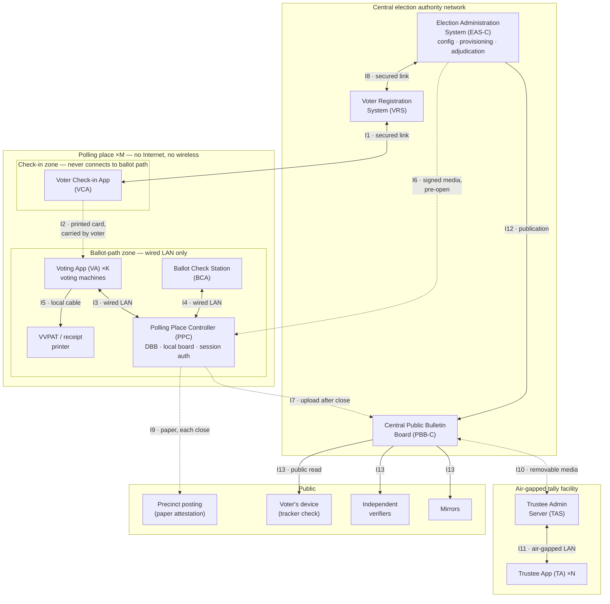

# On-Site E2E-V System Architecture: Components, Interconnections, and Protocol Flows

**Date:** 2026-07-05
**Status:** Investigation / architecture blueprint
**Series:** [Feasibility Assessment](./onsite-e2ev-feasibility.md) →
[Feature Variation Points](./onsite-e2ev-feature-variations.md) →
[Crypto Kernel Primer](./onsite-e2ev-crypto-kernel.md) → this document

This document provides the architectural blueprint for the on-site E2E-V system, in the style of
the *Architecture: Building the Blueprint* section of the
[Rigorous Digital Engineering article](https://rde.freeandfair.us/article/): components grouped by
trust zone and network boundary, with every authorized communication path shown, and — critically
for a voting protocol — where and how cryptographic operations occur on each path. It is the
on-site analogue of the E2E-VIV system diagram in the [CONOPS](./conops/conops.md).

## Assumed Product-Line Instance

Per the *Recommended Baseline Instance and Phasing* section of the
[feature-variation catalog](./onsite-e2ev-feature-variations.md), this architecture assumes the
full **Baseline** feature set (Ristretto255 suite; Benaloh check station **plus** VVPAT; tracker
receipts + precinct chain-head attestation + post-close publication with independent mirrors;
mixnet tally; plurality/M-of-N/IRV contests; explicit-blank support; multi-language rendering;
per-precinct reporting with anonymity floor; L&A test mode with signed dispositions; standard
election-record bundle + reference verifier) **plus** three Phase 2 features:

- **Provisional ballots** (pended cryptograms with signed adjudication dispositions),
- **Early voting** (multi-day voting period with daily close-out attestations), and
- **Free-text write-ins** (fixed-width padded encoding per constraint X5).

Additionally, per direction for this design: voter check-in issues a **printed authorization
card**. The Voter Check-in Application verifies the voter and prints a card authorizing one voting
session in a specific ballot style; the voter presents this card to the Voting Application on
*any* voting machine at the site, which unlocks their designated ballot. The card is the only
thing that crosses the mandated isolation gap between the check-in system and the ballot path —
and it is carried by the voter, not by a wire.

Parameters used below: `M` polling places, `K` voting machines per place, `N` trustees with
threshold `T`, election configuration hash `election_hash` (which contains the product-line
instance descriptor, so the feature selection itself is trustee-endorsed and publicly committed).

## Component Inventory

| Component | Trust zone | Role | Key material held |
|---|---|---|---|
| Voter Check-in Application (**VCA**) | Polling place, check-in zone | Verify voter identity/eligibility, assign ballot style, print authorization cards, keep check-in journal | VCA Ed25519 signing key; `election_hash` |
| Voting Application (**VA**), ×K | Polling place, ballot-path zone | Present ballot, encode + encrypt selections, submit/cast, drive printer | Election public key; per-session ephemeral Ed25519 key pair; per-ballot randomizers (transient) |
| VVPAT / receipt printer (**PRN**) | Polling place, ballot-path zone (peripheral of each VA) | Print voter-verifiable paper record and tracker receipts | None |
| Polling Place Controller (**PPC**) | Polling place, ballot-path zone | Digital Ballot Box + local bulletin board + session authorization; the only ballot-path device that ever talks to the outside — and only after close | DBB Ed25519 signing key; session-authorization signing key; VCA verifying keys; consumed-nonce ledger |
| Ballot Check Station (**BCS**) | Polling place, ballot-path zone | Ballot Check Application for Benaloh challenges (with audio readback) | Per-check ephemeral ElGamal + Ed25519 key pairs |
| Voter Registration System (**VRS**) | Central authority network | Voter rolls, check-in status, participation records, provisional evidence | VRS signing key; roll data (never ballot data) |
| Election Administration System (**EAS-C**) | Central authority network | Election definition, device provisioning, L&A testing, provisional adjudication, dispositions | EA signing key; software-signing keys |
| Central Public Bulletin Board (**PBB-C**) | Central authority network, publicly readable | Aggregates site board segments, publishes the election record and tally transcript | Publication signing key |
| Trustee Administration Server (**TAS**) | Air-gapped tally facility | Trustee message board; ferries data across the air gap via media | TAS Ed25519 signing key |
| Trustee Application (**TA**), ×N | Air-gapped tally facility | Setup endorsement, DKG, mixing, decryption | Trustee Ed25519 signing key; trustee ElGamal encryption key pair; private key share (post-DKG) |
| Independent verifiers, mirrors, voters' devices | Public | Re-verify the published record; detect equivocation; tracker checks | Public keys only |

## Architectural Diagram

Solid edges are wired electronic links (no wireless, no Internet, anywhere in the ballot path,
ever). Dashed edges are physical transfers (printed paper or removable media carried by people)
or links permitted **only after polls close**. Each edge is an interconnection `I1`–`I13`,
detailed in the flow catalog below.

**Isolation rules embodied in the diagram.** Voting machines (VA) have exactly two connections:
the wired LAN to the PPC and a local printer cable — never anything else (requirement: never
connected to the Internet or any wireless/public network). The PPC has no external connectivity
while polls are open; `I7` activates only after close. The VCA is never connected to any
ballot-path device (requirement 5); the printed card carried by the voter (`I2`) is the only
information path across that gap. The VCA's secured link to the VRS (`I1`) is permissible because
the check-in zone handles no ballot data — jurisdictions preferring a fully offline check-in
operate `I1` in pre-open/post-close batch mode only, at the cost of same-day cross-site
double-check-in prevention during early voting. The tally facility touches the world only through
removable media (`I10`).

## Interconnection Index

| ID | Endpoints | Channel | Active | Flows |
|---|---|---|---|---|
| I1 | VCA ↔ VRS | Secured network link (outside ballot path) | Pre-open, open, post-close | F1.1 provisioning, F1.2 check-in sync, F1.3 reconciliation |
| I2 | VCA → VA | Printed card, carried by voter | Polls open | F2.1 ballot-style authorization |
| I3 | VA ↔ PPC | Wired polling-place LAN | Polls open | F3.1 session activation, F3.2 submission, F3.3 cast, F3.4 forwarded check request, F3.5 randomizer transmission |
| I4 | BCS ↔ PPC | Wired polling-place LAN | Polls open | F4.1 check request + entry retrieval, F4.2 randomizer delivery + display |
| I5 | VA → PRN | Local printer cable | Polls open | F5.1 VVPAT print, F5.2 tracker receipt |
| I6 | EAS-C → PPC/VA/BCS | Signed removable media (or supervised one-time wired) | Pre-open only | F6.1 configuration provisioning, F6.2 L&A test session |
| I7 | PPC → PBB-C | Secure network or physical media | After each daily close; final close | F7.1 board segment upload |
| I8 | EAS-C ↔ VRS | Central secured network | Setup; post-close | F8.1 eligibility snapshot, F8.2 provisional adjudication |
| I9 | PPC → precinct posting | Printed paper, publicly posted | Each daily close; final close | F9.1 chain-head attestation |
| I10 | PBB-C ↔ TAS | Removable media across the air gap | Post final close | F10.1 tally input import, F10.2 tally transcript export |
| I11 | TAS ↔ TA | Air-gapped wired LAN | Pre-open (setup, DKG); post-close (mix, decrypt) | F11.1 setup endorsement, F11.2 DKG, F11.3 mixing, F11.4 decryption |
| I12 | EAS-C → PBB-C | Central secured network | Pre-open; post-close | F12.1 config publication, F12.2 disposition publication |
| I13 | PBB-C → public | Public read access | Post final close (config from pre-open) | F13.1 tracker lookup, F13.2 full verification, F13.3 mirroring |

Cryptographic algorithm names used below (all as instantiated by the baseline Ristretto255
context — see the [kernel primer](./onsite-e2ev-crypto-kernel.md)): **Ed25519** signatures;
**ElGamal** encryption (`EVS` Def. 11.15); **Naor-Yung** (NY) encryption with plaintext-equality
proof (`EVS` Def. 11.31 / Prot. 10.8); **Joint-Feldman DKG** (`EVS` Prot. 16.20);
**Terelius-Wikström** (TW) shuffle proof (`EVS` Prot. 12.3); **Chaum-Pedersen** discrete-log
equality proof (`EVS` Prot. 10.3); **SHA-3/SHA-512-family hashing** for the board chain, trackers,
pseudonyms, and Fiat-Shamir challenges; OS-provided **CSPRNG** for all keys, nonces, and
randomizers. Structures marked **†** are new subprotocol elements for the on-site product line;
unmarked structures reuse the existing VoteSecure
[protocol specs](./protocol/specs/) as written.

---

## I1: Voter Check-in Application ↔ Voter Registration System

### F1.1 — Check-in provisioning (pre-open)

1. **What it does:** loads each VCA with its site's certified voter-roll extract, ballot-style
   assignments, early-voting validity calendar, and the signed election configuration hash.
2. **Initiator:** election officials, via the VRS.
3. **Pre-conditions:** trustee-endorsed election configuration exists (F11.1) and is published
   (F12.1); rolls certified; VCA device imaged with attested software.
4. **Inputs → outputs:** roll extract, style map, calendar, `election_hash` → provisioned VCA;
   provisioning receipt (bundle hash) logged in the VRS.
5. **Cryptography:** EA Ed25519 signature over the provisioning bundle (VCA verifies before
   accepting); VCA Ed25519 signing key generated on-device, its verifying key registered with the
   VRS and delivered to the EAS-C for inclusion in PPC provisioning (F6.1); SHA-3 `election_hash`
   binds the bundle to this election.
6. **Post-conditions:** *success* — VCA operational for its site and dates; *failure* (signature
   or hash mismatch) — device rejected, not placed in service.

### F1.2 — Check-in status synchronization (polls open)

1. **What it does:** records each voter's check-in (regular or provisional) centrally, in near
   real time, so no voter can check in twice — at this site or any other — during multi-day early
   voting.
2. **Initiator:** VCA, on each completed check-in.
3. **Pre-conditions:** F1.1 done; voter identity verified per local procedure; link available
   (offline fallback: entries queue locally and reconcile via F1.3, with conflicts resolved to the
   provisional path).
4. **Inputs → outputs:** check-in record {voter record ID, site, timestamp, status
   regular/provisional, SHA-3 commitment to the issued card's activation nonce} → acknowledgment;
   central status updated (voter blocked from further regular check-ins).
5. **Cryptography:** Ed25519 signature by the VCA key over each record; SHA-3 nonce commitment
   (the nonce itself never leaves the polling place except sealed for provisional voters, F8.2);
   channel confidentiality/integrity via standard transport security (outside protocol scope).
6. **Post-conditions:** *success* — voter marked checked-in everywhere; *offline* — queued with
   deferred reconciliation; *conflict detected* — later check-in refused or routed provisional.

### F1.3 — Post-close reconciliation and participation records (each daily close; final close)

1. **What it does:** uploads the complete signed check-in journal; reconciles cards issued against
   check-ins recorded; produces participation records (derived from check-in only — constraint
   X10 — never from bulletin-board contents).
2. **Initiator:** poll workers during close-out.
3. **Pre-conditions:** site closed for the day/election; VCA journal intact.
4. **Inputs → outputs:** hash-chained, signed check-in journal (including card reissue log) →
   reconciled central roll status; participation records; discrepancy report (issued vs.
   checked-in vs. — after F7.1 — cast counts, batch level only).
5. **Cryptography:** Ed25519 signatures on journal entries; SHA-3 chaining of the journal (same
   tamper-evidence construction as the ballot board, applied to check-in data).
6. **Post-conditions:** *reconciled* — turnout/participation reporting available; *discrepancy* —
   incident procedure; provisional records staged for adjudication (F8.2).

## I2: Voter Check-in Application → Voting Application (printed card)

### F2.1 — Ballot-style authorization card

1. **What it does:** conveys a single-use, ballot-style-scoped voting authorization across the
   mandated isolation gap between check-in and the ballot path. The voter is the transport. The
   card lets the voter use **any** voting machine at the site.
2. **Initiator:** VCA, printing automatically on successful check-in.
3. **Pre-conditions:** voter checked in (F1.2, or queued offline); ballot style determined; PPC
   already holds this VCA's verifying key (F6.1).
4. **Inputs → outputs:** card fields {`election_hash`, site ID, ballot style, activation nonce,
   validity window (the early-voting day), provisional flag} → printed card carrying the fields
   plus signature, as QR code and human-readable text; `CardAuthorization`† record retained in the
   VCA journal.
5. **Cryptography:** 128-bit activation nonce from the CSPRNG (unguessable, single-use); Ed25519
   signature by the VCA key over all card fields (this is what the PPC will verify — no live
   connection between VCA and PPC is ever needed); SHA-3 hash of the card body serves as the card
   ID in journals. **Deliberately absent:** any voter identity — the card carries style + nonce,
   not a name, so the ballot path never learns who the voter is.
6. **Post-conditions:** *success* — voter holds a credential redeemable once, at this site, during
   its window; *card expires unredeemed* — void, visible in reconciliation (F1.3); *card lost* —
   poll-worker-authorized reissue with a fresh nonce, logged; reissues are reconciled against
   redemption counts post-close and flagged if both nonces were redeemed.

## I3: Voting Application ↔ Polling Place Controller (wired LAN)

### F3.1 — Session activation† (replaces the Internet-era voter-authentication subprotocol)

1. **What it does:** converts a valid card into an authorized voting session bound to a fresh
   session key pair and a pseudonym, unlocking the correct ballot style on this machine.
2. **Initiator:** VA, when the voter scans their card.
3. **Pre-conditions:** F6.1 provisioning (PPC holds VCA verifying keys and configuration); card's
   validity window matches today; polls open.
4. **Inputs → outputs:** `SessionActivationMsg`† {`election_hash`, `CardAuthorization`†, fresh
   session verifying key}, signed by the session signing key → `SessionAuthMsg`† (the on-site
   analogue of `AuthVoterMsg`) {`election_hash`, voter pseudonym, session verifying key, ballot
   style, provisional flag}, signed by the PPC's session-authorization key; retained by the PPC
   for later submission/cast validation and returned to the VA.
5. **Cryptography:** VA generates an ephemeral Ed25519 session key pair (CSPRNG); PPC verifies
   the card's Ed25519 signature against its provisioned VCA verifying keys, checks the activation
   nonce against its consumed-nonce ledger, and derives the pseudonym as
   SHA-3(`activation nonce` ‖ `election_hash`) — one-way, so the published board can never be
   linked back to a nonce or a voter; PPC signs the authorization (Ed25519).
6. **Post-conditions:** *success* — session active, nonce marked consumed, ballot presented in the
   designated style (write-in entry fields enabled where the style allows); *rejections* (unknown
   VCA key / spent nonce / wrong window or site / bad signature) — distinct error surfaced to poll
   workers, no state consumed except an audit log entry; *machine failure mid-session* —
   poll-worker-authorized void-and-reissue, logged and reconciled.

### F3.2 — Ballot submission (existing [ballot submission spec](./protocol/specs/ballot-submission-spec.md), adapted)

1. **What it does:** commits the encrypted ballot to the local board and returns the tracker —
   the Benaloh "commit before choosing cast-or-check" step.
2. **Initiator:** VA, after the voter completes selections (including any free-text write-ins)
   and reviews the summary screen.
3. **Pre-conditions:** active session (F3.1); ballot encoded and encrypted.
4. **Inputs → outputs:** `SignedBallotMsg` {`election_hash`, pseudonym, session verifying key,
   ballot style, ballot cryptogram} with session-key signature → `BallotSubBulletin` appended to
   the chained board (carrying the provisional flag† when set) and `TrackerMsg` {`election_hash`,
   tracker, result} signed by the DBB key; VA retains the randomizers for a possible check.
5. **Cryptography:** ballot encoding is the fixed-width padded rank encoding — the write-in text
   field is a fixed-length, padded slot so **every ciphertext of a given style is shape-identical**
   (constraint X5; nothing about the ciphertext reveals whether a write-in was used); Naor-Yung
   encryption of the encoded ballot under the election public key (2× ElGamal over Ristretto255 +
   plaintext-equality proof), randomizers from the CSPRNG; Ed25519 session signature over the
   message data; PPC verifies the session authorization, the signature, the NY proof, and
   duplicate/style checks; board append computes the SHA-3 chain hash and DBB Ed25519 signature;
   **tracker = hash of the bulletin entry**.
6. **Post-conditions:** *success* — ballot submitted (not yet cast), tracker receipt printed
   (F5.2); *rejection* (invalid proof/signature, duplicate ciphertext, style mismatch, no
   authorization) — recorded, nothing appended, voter assisted; the voter now chooses: cast (F3.3)
   or check (F4.1).

### F3.3 — Ballot cast (existing [ballot cast spec](./protocol/specs/ballot-cast-spec.md), adapted)

1. **What it does:** irrevocably marks the submitted ballot as cast.
2. **Initiator:** VA, on the voter's cast command.
3. **Pre-conditions:** F3.2 succeeded; this submission is the most recent for the pseudonym; the
   ballot was not spoiled by a check; no prior cast exists for this pseudonym.
4. **Inputs → outputs:** `CastReqMsg` {`election_hash`, pseudonym, session verifying key, tracker}
   with session-key signature → `VoterAuthBulletin` (publishing the session authorization) and
   `BallotCastBulletin` appended; cast confirmation to the VA; VVPAT printed (F5.1). Provisional
   sessions: the cast bulletin carries provisional-pending status† — the cryptogram enters the
   tally only via an including disposition (F8.2/F12.2).
5. **Cryptography:** Ed25519 signature verification; the cast-spec board checks (most-recent
   submission, exactly one cast per pseudonym, matching keys) enforced against the chained board;
   SHA-3 chain hash + DBB Ed25519 signature on both new bulletins.
6. **Post-conditions:** *success* — exactly one cast recorded for this pseudonym, forever;
   *rejections* (stale tracker, prior cast, signature/authorization mismatch) — no state change,
   error surfaced.

### F3.4 — Forwarded check request (existing [ballot check spec](./protocol/specs/ballot-check-spec.md))

1. **What it does:** relays a vetted check-station request to the VA that holds the randomizers;
   begins mutual authentication-by-comparison between the two devices, through the voter's eyes.
2. **Initiator:** PPC, after validating F4.1.
3. **Pre-conditions:** submission exists and is uncast; the session that produced it is still open
   on the VA.
4. **Inputs → outputs:** `FwdCheckReqMsg` {`election_hash`, embedded `CheckReqMsg`} signed by the
   DBB key → VA displays the check station's public-key fingerprint for the voter to compare with
   the one the check station shows.
5. **Cryptography:** Ed25519 verification of the DBB signature (VA) — the DBB's countersignature
   throttles forged requests; fingerprint = short SHA-3 rendering of the BCA's ephemeral public
   key.
6. **Post-conditions:** *fingerprints match (voter confirms)* — proceed to F3.5; *mismatch or
   timeout* — abort, incident log, ballot remains submitted-uncast.

### F3.5 — Randomizer transmission (existing ballot check spec)

1. **What it does:** confidentially delivers the encryption randomizers to the check station so it
   can independently reproduce the encryption and open the commitment.
2. **Initiator:** VA, after the voter confirms fingerprints.
3. **Pre-conditions:** F3.4 confirmed.
4. **Inputs → outputs:** randomizer message: the ballot's randomizers encrypted to the BCA's
   ephemeral public encryption key, signed by the session key → relayed by the PPC to the BCS
   (F4.2).
5. **Cryptography:** ElGamal/Naor-Yung encryption of the randomizer vector (width 2W) under the
   BCA ephemeral key — the PPC relays but cannot read the randomizers; Ed25519 signatures on the
   relay legs.
6. **Post-conditions:** the ballot is now **checked = spoiled** — it can never be cast (Benaloh
   discipline: a machine cannot know in advance whether it will be audited); a spoil disposition
   entry† is recorded so turnout arithmetic distinguishes spoiled-by-check from abandoned
   submissions; the voter revotes afterwards (new submission under the same session, or
   poll-worker-assisted reactivation, per F3.1 rules).

## I4: Ballot Check Station ↔ Polling Place Controller (wired LAN)

### F4.1 — Check request and board-entry retrieval

1. **What it does:** starts a Benaloh check: the voter takes their tracker receipt to the check
   station, which fetches the board entry and asks the PPC to broker randomizer disclosure.
2. **Initiator:** BCA, voter-driven (tracker typed or scanned).
3. **Pre-conditions:** the tracker corresponds to a submitted, uncast ballot; BCS provisioned with
   the configuration and DBB verifying key (F6.1).
4. **Inputs → outputs:** BCA generates fresh ephemeral key pairs, then `CheckReqMsg`
   {`election_hash`, tracker, BCA public encryption key, BCA verifying key} signed with the BCA
   ephemeral signing key → PPC returns the `BallotSubBulletin`; BCA verifies it and displays the
   entry's pseudonym for the voter to compare; PPC forwards the request to the VA (F3.4).
5. **Cryptography:** ephemeral ElGamal encryption + Ed25519 signing key pairs (CSPRNG, per check
   session — unlinkable across checks); Ed25519 request signature; BCA verifies the DBB Ed25519
   signature and SHA-3 chain linkage on the retrieved bulletin.
6. **Post-conditions:** *valid* — request pending at the VA; *invalid tracker / already cast /
   malformed* — refusal with reason, nothing disclosed.

### F4.2 — Randomizer delivery, local decryption, and display

1. **What it does:** completes cast-as-intended verification: the check station opens the
   encryption and shows (and, for accessibility, reads aloud) the plaintext choices — including
   any write-in text — for the voter to compare against what they selected.
2. **Initiator:** PPC, relaying F3.5.
3. **Pre-conditions:** F3.5 sent; fingerprints matched.
4. **Inputs → outputs:** encrypted randomizer message → decrypted plaintext ballot rendered on the
   BCS display / audio readback; check outcome recorded.
5. **Cryptography:** ElGamal decryption with the BCA ephemeral private key recovers the
   randomizers; the BCA **re-computes the Naor-Yung encryption** of the displayed plaintext under
   the election public key with those randomizers and checks byte-equality against the board
   ciphertext — this equality is the actual proof that the display matches the record; rank
   decoding (including the padded write-in field) maps the plaintext to contests.
6. **Post-conditions:** *match* — statistical evidence the machine encrypts honestly (the machine
   could not know this ballot would be audited); *mismatch* — a machine is caught red-handed:
   incident, machine quarantined, evidence preserved; **either way the checked ballot is spoiled**
   and the voter revotes.

## I5: Voting Application → Printer (local peripheral)

### F5.1 — VVPAT print on cast

1. **What it does:** produces the voter-verifiable paper record of the cast ballot, reviewed
   behind glass and deposited into a sealed box — the paper trail for certification and
   risk-limiting audits.
2. **Initiator:** VA, at successful F3.3.
3. **Pre-conditions:** cast confirmed on the board.
4. **Inputs → outputs:** plaintext ballot summary → printed record; deposited in precinct custody
   (never leaves the polling place — receipt-freedom, constraint X6).
5. **Cryptography:** none on the record's content, deliberately — it must be human-readable; and
   **deliberately no tracker, pseudonym, or ciphertext digest on the paper** (constraint X6
   forbids ballot-level paper↔cryptogram linkage; paper reconciles with the electronic record at
   batch level only).
6. **Post-conditions:** paper record in sealed custody; per-machine VVPAT counts reconcile against
   cast-bulletin counts at close (batch level); printer failure → cast stands electronically,
   incident procedure governs (jurisdiction rule on paper mandate).

### F5.2 — Tracker receipt print

1. **What it does:** gives the voter their take-home tracker for the recorded-as-cast check.
2. **Initiator:** VA, at F3.2 success.
3. **Pre-conditions:** submission accepted.
4. **Inputs → outputs:** tracker (bulletin hash), `election_hash`, site, timestamp → printed
   receipt; contains no vote content and is safe (and legal) to take home.
5. **Cryptography:** the tracker *is* a SHA-3-family hash of the board entry; a QR-rendered DBB
   Ed25519 signature over the receipt fields lets anyone later authenticate the receipt itself.
6. **Post-conditions:** voter can check the published board after close (F13.1); a receipt whose
   tracker never appears on the published board, together with the precinct attestation (F9.1),
   is publicly verifiable evidence of a problem.

## I6: Election Administration System → Polling-Place Devices (signed media, pre-open)

### F6.1 — Configuration and key provisioning

1. **What it does:** installs the trustee-endorsed election configuration and all public key
   material on every polling-place device before opening; the configuration embeds the
   product-line instance descriptor, so the deployed feature set is itself cryptographically
   committed.
2. **Initiator:** EA officials (supervised provisioning ceremony).
3. **Pre-conditions:** setup and DKG complete (F11.1, F11.2) — election public key exists and
   carries N trustee signatures; configuration published (F12.1); devices imaged with signed,
   attested software.
4. **Inputs → outputs:** signed configuration {manifest; contest/style definitions including
   write-in field lengths; election public key; trustee roster + verifying keys; VCA verifying
   keys; early-voting calendar; instance descriptor} → configured PPC/VA/BCS; provisioning
   receipts (installed-bundle hashes) logged centrally; PPC generates its DBB and
   session-authorization signing keys, escrows the *verifying* halves to the EAS-C for
   publication.
5. **Cryptography:** N× trustee Ed25519 signatures over the configuration (from F11.1); SHA-3
   `election_hash` — the value every subsequent protocol message must carry; software-manifest
   signatures verified by device boot attestation; on-device Ed25519 key generation (CSPRNG).
6. **Post-conditions:** *success* — site ready, all devices agree on `election_hash`; *any
   verification failure* — device not placed in service; the published configuration lets any
   observer later confirm exactly which software and features every site ran.

### F6.2 — Logic-and-accuracy (L&A) test session

1. **What it does:** public pre-election test: flagged test cards drive real end-to-end flows
   (F3.1–F3.3, F4.1–F4.2) on the production equipment; every test cryptogram is then provably
   excluded from the tally.
2. **Initiator:** EA officials, in the presence of observers.
3. **Pre-conditions:** F6.1 complete; board empty except configuration.
4. **Inputs → outputs:** test `CardAuthorization`†s (test-flagged) and scripted selections → test
   bulletins on the board (flagged†); a signed `DispositionRecord`† enumerating and excluding
   every test cryptogram; a public L&A report.
5. **Cryptography:** identical to the live flows (that is the point), plus EA Ed25519 signatures
   over the disposition records, which reference cryptograms by their bulletin hashes.
6. **Post-conditions:** *pass* — devices sealed, test entries remain on the board (transparency)
   but are excluded from the mix input by signed disposition (constraint X8); *fail* — device
   replaced, test repeated.

## I7: Polling Place Controller → Central Bulletin Board (after close)

### F7.1 — Board segment upload

1. **What it does:** transfers the site's chained board — nightly segments during early voting,
   and the final segment at close — for central aggregation and publication.
2. **Initiator:** poll workers during close-out (controller export function).
3. **Pre-conditions:** polls closed (for the day or finally); board quiesced; chain-head
   attestation printed first (F9.1).
4. **Inputs → outputs:** `BoardSegmentMsg`† {`election_hash`, site ID, ordered bulletins,
   previous-segment head, segment head hash}, signed by the DBB key → PBB-C validation and merge
   into the central election record; acknowledgment with the centrally recorded head.
5. **Cryptography:** PBB-C re-verifies the SHA-3 chain over every entry, every DBB Ed25519
   bulletin signature, segment continuity with the previous night's head, and equality of the
   segment head with the printed attestation value; PBB-C Ed25519 publication signature over the
   accepted segment.
6. **Post-conditions:** *success* — the site's record is durable and (after final close) public;
   each early-voting day becomes tamper-evident even against later compromise of the controller;
   *mismatch with the attestation* — publicly investigable integrity incident, site records
   quarantined.

## I8: Election Administration System ↔ Voter Registration System (central)

### F8.1 — Eligibility snapshot (setup)

1. **What it does:** supplies certified eligibility and districting data from which per-site roll
   extracts and ballot-style mappings are derived (feeding F1.1).
2. **Initiator:** EA, at election definition time.
3. **Pre-conditions:** registration close per statute; districting current.
4. **Inputs → outputs:** certified roll + district data → per-site extracts and style maps.
5. **Cryptography:** VRS Ed25519 signature over the snapshot; snapshot hash recorded in the
   election configuration (so the rolls used are themselves committed).
6. **Post-conditions:** extracts staged for F1.1; snapshot hash published with the configuration.

### F8.2 — Provisional adjudication (post-close)

1. **What it does:** resolves every provisional check-in — was this voter eligible? — and turns
   each resolution into a signed include/exclude decision for the corresponding pended cryptogram.
2. **Initiator:** EA adjudication workflow (statutory process, with observers per local law).
3. **Pre-conditions:** F1.3 reconciliation done; provisional bulletins present in uploaded
   segments (F7.1); statutory adjudication window open.
4. **Inputs → outputs:** provisional check-in records + voter-supplied evidence → per-cryptogram
   signed `DispositionRecord`† (include / exclude, with reason category); published via F12.2.
5. **Cryptography:** for provisional issuances **only**, the VCA journal retains the sealed
   activation nonce, letting adjudicators recompute the pseudonym SHA-3(nonce ‖ `election_hash`)
   and thus tie *this voter's eligibility decision* to *that pended cryptogram* — a deliberate,
   narrowly-scoped linkage identical in effect to the envelope on a paper provisional ballot; the
   ballot **content** remains encrypted throughout — adjudication decides inclusion, never reads
   votes; Ed25519 signatures by adjudicator and EA over each disposition.
6. **Post-conditions:** every provisional cryptogram has exactly one signed disposition (include /
   exclude / excluded-by-default at deadline, per jurisdiction rule); the disposition set is part
   of the public record and of the mix-input completeness check (F10.1).

## I9: Polling Place Controller → Precinct Public Posting (paper)

### F9.1 — Chain-head attestation

1. **What it does:** at every daily close and at final close, prints the current board head hash
   and entry counts; poll workers post it publicly at the precinct and file it in signed close-out
   paperwork; observers photograph it. This binds what the precinct saw to what will later be
   published, using nothing but paper and witnesses.
2. **Initiator:** poll workers (controller close-out function).
3. **Pre-conditions:** board quiesced for the day/election.
4. **Inputs → outputs:** {`election_hash`, site, date, board head hash, counts: submitted / cast /
   checked-spoiled / provisional-pending, VVPAT batch count} → printed attestation (QR +
   human-readable); public posting + paperwork copy.
5. **Cryptography:** the head hash is the SHA-3 chain head; DBB Ed25519 signature over the
   attestation fields, rendered in the QR so any photograph is independently verifiable.
6. **Post-conditions:** distributed, timestamped, witness-held evidence of the site's state at
   each close; any divergence between attestations and the published record (F7.1/F13) is
   publicly demonstrable by anyone holding a photo.

## I10: Central Bulletin Board ↔ Trustee Administration Server (removable media)

### F10.1 — Tally input import (into the air gap)

1. **What it does:** brings the complete published election record into the air gap and fixes,
   verifiably, the exact set of cryptograms to be mixed.
2. **Initiator:** EA officials, with the trustees convened and witnessing.
3. **Pre-conditions:** final close; all segments merged and published (F7.1); all dispositions
   published (F12.2); trustee ceremony convened with threshold ≥ T present.
4. **Inputs → outputs:** board snapshot + configuration + full disposition set → TAS posts the
   `MixInitializationMsg` (existing [trustee mixing spec](./protocol/specs/trustee-mixing-spec.md))
   whose cryptogram list the trustees independently validate.
5. **Cryptography:** each trustee independently re-verifies: SHA-3 chain integrity of every
   segment; DBB and PBB-C Ed25519 signatures; the Naor-Yung plaintext-equality proof of **every**
   cryptogram; duplicate detection; and **mix-input completeness** — the list equals {all cast
   cryptograms} minus {signed exclusions: test, provisional-excluded} plus {signed inclusions:
   provisional-included}, i.e., the mixing spec's "valid explanation" check made machine-checkable
   against the published dispositions (constraint X8); TAS Ed25519 signature on the initialization
   message.
6. **Post-conditions:** *agreement* — committed input set, mixing may begin; *any unexplained
   missing or extra cast cryptogram* — ceremony halts publicly before any mixing occurs.

### F10.2 — Tally transcript export (out of the air gap)

1. **What it does:** carries the complete verifiable tally out of the air gap for publication.
2. **Initiator:** EA officials, post-ceremony.
3. **Pre-conditions:** F11.3 and F11.4 complete with every trustee's verification passing.
4. **Inputs → outputs:** `TallyTranscript`† bundle = {stripped input cryptograms; every mix
   round's output list + TW shuffle proof (per style / reporting group, with anonymity-floor
   grouping applied); every partial decryption + Chaum-Pedersen proof; plaintext ballots;
   N trustee Ed25519 signatures over the result; computed tallies including IRV elimination
   rounds; the write-in adjudication queue (normalized free-text results published after the
   statutory canvass step)} → published on the PBB-C (F13).
5. **Cryptography:** the transcript *is* the cryptographic evidence — TW proofs (`EVS` 12.3),
   Chaum-Pedersen proofs (`EVS` 10.3), trustee signatures; PBB-C publication signature over the
   bundle.
6. **Post-conditions:** anyone can perform F13.2; results move to canvass; the air gap is never
   crossed by anything else.

## I11: Trustee Administration Server ↔ Trustee Applications (air-gapped LAN)

These four flows are the existing VoteSecure trustee subprotocols, unchanged in structure; see the
[setup](./protocol/specs/setup-spec.md),
[election key generation](./protocol/specs/election-key-gen-spec.md),
[trustee mixing](./protocol/specs/trustee-mixing-spec.md), and
[trustee decryption](./protocol/specs/trustee-decryption-spec.md) specs for message-level detail.

### F11.1 — Setup endorsement (pre-open)

1. **What it does:** all trustees review and sign the election configuration — including the
   trustee roster/keys (establishing trustee PKI) and the product-line instance descriptor.
2. **Initiator:** TAS (distributes `SetupMsg`).
3. **Pre-conditions:** trustee identities and verifying keys confirmed out of band.
4. **Inputs → outputs:** `SetupMsg` {originator, signer, manifest, threshold T, trustee list} →
   one endorsement `SetupMsg` per trustee, signer set to themselves.
5. **Cryptography:** Ed25519 signatures over the serialized configuration data; SHA-3 of the
   endorsed configuration becomes `election_hash`.
6. **Post-conditions:** *all N endorse* — configuration fixed, key generation may start; *any
   trustee rejects* — configuration revised, process restarts.

### F11.2 — Distributed key generation (pre-open)

1. **What it does:** generates the election key pair such that the private key exists only as N
   shares with threshold T (see the [kernel primer §3](./onsite-e2ev-crypto-kernel.md)).
2. **Initiator:** each trustee posts to the TAS trustee board.
3. **Pre-conditions:** F11.1 complete.
4. **Inputs → outputs:** per trustee, `KeySharesMsg` {check values; pairwise shares encrypted to
   each trustee's public encryption key} → verified shares; then one `ElectionPublicKeyMsg` per
   trustee → N identical, signed election public keys.
5. **Cryptography:** Joint-Feldman DKG (`EVS` 16.20): CSPRNG polynomial generation, Feldman check
   values, ElGamal encryption of pairwise shares, Ed25519 message signatures; each trustee
   verifies every share against the check values and computes the joint key + their private share
   + everyone's verification keys.
6. **Post-conditions:** *success* — election public key fixed and N-signed (feeds F6.1/F12.1);
   *any share check fails or keys differ* — immediate abort, out-of-band alarm, restart after
   investigation.

### F11.3 — Verifiable mixing (post-close)

1. **What it does:** unlinks ballots from pseudonyms: each trustee in turn re-encrypts and
   permutes the full cryptogram set, with a proof of shuffle checked by all others.
2. **Initiator:** TAS posts `MixInitializationMsg` (from F10.1); trustees proceed in the published
   order.
3. **Pre-conditions:** F10.1 agreement; at least the threshold set of trustees present (the
   `active_trustees` list).
4. **Inputs → outputs:** validated NY cryptograms → stripped ElGamal cryptograms
   (`EGCryptogramsMsg`, K identical postings) → per trustee: shuffled list + `MixRoundProof`,
   each batched per ballot style / reporting group → final mixed lists all trustees have verified.
5. **Cryptography:** NY proof re-verification and strip (plaintext-equality proof, `EVS` 10.8);
   per round: ElGamal re-encryption with fresh CSPRNG randomizers + Terelius-Wikström proof
   (`EVS` 12.3) with SHA-3 Fiat-Shamir challenges over the full transcript (the challenge-binding
   completeness flagged in the kernel primer is a precondition for relying on this); Ed25519
   signatures on every board message.
6. **Post-conditions:** *all rounds verify* — anonymized ciphertext set agreed; *any proof fails*
   — abort naming the failing round's trustee, publicly attributable.

### F11.4 — Threshold decryption (post-close)

1. **What it does:** opens the mixed ciphertexts with a public correctness receipt for every
   trustee's contribution.
2. **Initiator:** each participating trustee, from the final mixing state.
3. **Pre-conditions:** F11.3 verified; ≥ T trustees participating.
4. **Inputs → outputs:** mixed ciphertexts → per trustee: partial decryptions + proofs → combined
   plaintext ballots, trustee-signed; tallies computed (plurality/M-of-N sums, IRV elimination
   rounds on plaintext rankings, write-in queue extraction).
5. **Cryptography:** partial decryption with each trustee's private share; Chaum-Pedersen
   discrete-log-equality proof (`EVS` 10.3) per trustee per ciphertext against the DKG-derived
   verification keys; Lagrange combination of ≥ T verified factors; rank decoding (including
   padded write-in fields); Ed25519 signatures over the plaintext set.
6. **Post-conditions:** *success* — plaintexts and tallies fixed, transcript assembled (F10.2);
   *invalid partial decryption* — attributable abort: honest trustees identify exactly which
   trustee cheated and halt.

## I12: Election Administration System → Central Bulletin Board

### F12.1 — Configuration publication (pre-open)

1. **What it does:** publishes the trustee-endorsed configuration as the root entry of the public
   election record — the public commitment to keys, contests, sites, calendar, and the instance
   descriptor.
2. **Initiator:** EA, after F11.1/F11.2.
3. **Pre-conditions:** N trustee endorsements and N identical election-public-key signatures.
4. **Inputs → outputs:** signed configuration + election public key → root of the published
   record; trustees (and anyone) verify out of band that the published key is the one they signed.
5. **Cryptography:** N trustee Ed25519 signatures; SHA-3 `election_hash`; PBB-C publication
   signature.
6. **Post-conditions:** public root of trust exists before any ballot is cast; a published key
   that fails trustee-signature verification halts the election (per the key-generation spec's
   termination rule).

### F12.2 — Disposition publication (post-close, before F10.1)

1. **What it does:** publishes every signed `DispositionRecord`† — test exclusions (F6.2),
   provisional include/exclude decisions (F8.2), spoiled-by-check summaries, reissued-card voids —
   making the mix-input arithmetic publicly checkable.
2. **Initiator:** EA.
3. **Pre-conditions:** adjudication complete or statutory deadline reached; all segments uploaded.
4. **Inputs → outputs:** disposition set → published record; consumed by trustees (F10.1) and
   verifiers (F13.2).
5. **Cryptography:** Ed25519 signatures (EA + adjudicators) over each record; records reference
   cryptograms by bulletin hash.
6. **Post-conditions:** the equation "published cast cryptograms ± dispositions = mix input" is
   fixed and public before the air gap is crossed.

## I13: Central Bulletin Board → Public

### F13.1 — Voter tracker lookup

1. **What it does:** the recorded-as-cast check: a voter (or anyone they delegate) looks up their
   tracker on the published board.
2. **Initiator:** voter's device.
3. **Pre-conditions:** final publication complete; voter holds their receipt (F5.2).
4. **Inputs → outputs:** tracker → the matching bulletin with its chain context; confirmation the
   tracker appears, with cast status.
5. **Cryptography:** client verifies the SHA-3 chain linkage of the returned entry, the DBB and
   PBB-C Ed25519 signatures, and that hashing the entry reproduces the tracker.
6. **Post-conditions:** *found and valid* — recorded as cast, verified; *absent or altered* — the
   receipt (optionally with a photographed precinct attestation, F9.1) is publicly verifiable
   evidence backing a formal challenge.

### F13.2 — Full independent verification

1. **What it does:** the counted-as-recorded check, executable by anyone: recompute the entire
   election from published data.
2. **Initiator:** any verifier (reference verifier ships with the system; independent
   implementations follow the published verifier specification).
3. **Pre-conditions:** publication of segments (F7.1), dispositions (F12.2), and transcript
   (F10.2).
4. **Inputs → outputs:** the complete published record → a verifier report: chain integrity per
   site; configuration and trustee signatures; NY proof of every cryptogram; disposition
   arithmetic (mix input correctness); every TW shuffle proof; every Chaum-Pedersen decryption
   proof; recomputed tallies including IRV rounds; anonymity-floor conformance of reporting
   groups.
5. **Cryptography:** verification algorithms for every primitive in the
   [kernel](./onsite-e2ev-crypto-kernel.md); no secret inputs of any kind.
6. **Post-conditions:** *all checks pass* — the tally is arithmetically forced by the published
   record; *any check fails* — precise, public, machine-generated evidence of what failed and
   where.

### F13.3 — Mirroring and equivocation detection

1. **What it does:** independent parties (parties, press, NGOs) replicate the published record and
   cross-compare heads, ensuring everyone is shown the *same* record.
2. **Initiator:** mirror operators.
3. **Pre-conditions:** publication live.
4. **Inputs → outputs:** full record replication → mirror-signed observations of the record head;
   cross-mirror comparison (and comparison against photographed precinct attestations).
5. **Cryptography:** SHA-3 record heads; mirror Ed25519 signatures over observed heads.
6. **Post-conditions:** divergent heads anywhere → public, timestamped proof of equivocation; the
   board's tamper-*evidence* is thereby upgraded to practical tamper-*detection*.

---

## Reuse Map: Existing VoteSecure Subprotocols vs. New Elements

| Flow(s) | Status | Basis |
|---|---|---|
| F3.2, F3.3, F3.4, F3.5, F4.1, F4.2 | **Reused** (adapted transport; provisional flag added) | [ballot-submission](./protocol/specs/ballot-submission-spec.md), [ballot-cast](./protocol/specs/ballot-cast-spec.md), [ballot-check](./protocol/specs/ballot-check-spec.md) specs |
| F11.1–F11.4, F10.1 message set | **Reused** unchanged | [setup](./protocol/specs/setup-spec.md), [election-key-gen](./protocol/specs/election-key-gen-spec.md), [trustee-mixing](./protocol/specs/trustee-mixing-spec.md), [trustee-decryption](./protocol/specs/trustee-decryption-spec.md) specs |
| F2.1 `CardAuthorization`, F3.1 session activation | **New†** — the session-authorization subprotocol family (feature VP-D1); needs its own Tamarin model composed with the kernel | Replaces [voter-authentication](./protocol/specs/voter-authentication-spec.md) |
| F6.2, F8.2, F12.2 `DispositionRecord` machinery | **New†** — signed-disposition mechanism (VP-D2/D7); makes mixing-spec check #4 machine-checkable | Extends trustee-mixing input validation |
| F7.1 `BoardSegmentMsg`, F9.1 attestation | **New†** — publication/attestation layer (VP-B2, VP-D3) | Extends the bulletin-board abstraction |
| F1.1–F1.3, F8.1, participation records | **New†** — registration-side flows, firewalled from the ballot path (X10) | Outside the cryptographic protocol; procedural + signed-journal evidence |
| F10.2 `TallyTranscript` bundle | **New†** as a formalized artifact schema (VP-B4); contents are existing proof outputs | Packaging of F11.3/F11.4 outputs |

Consistent with the earlier documents in this series: the flows marked **New†** are exactly the
*compositional* additions identified in the
[feature-variation catalog](./onsite-e2ev-feature-variations.md) — each needs its own subprotocol
specification and Tamarin model composed with the unchanged, once-proven kernel, and the
completion of the kernel's Fiat-Shamir challenge binding remains the prerequisite for relying on
any of the proofs these flows transport.
