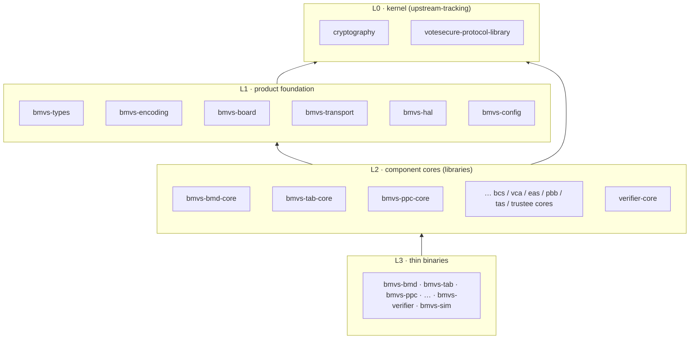

# Code Organization for the BMVS Product: Repositories, Workspaces, Crates, and Deployment

**Date:** 2026-07-07
**Status:** Investigation / engineering organization analysis
**Series:** [Feasibility Assessment](./onsite-e2ev-feasibility.md) →
[Feature Variation Points](./onsite-e2ev-feature-variations.md) →
[Crypto Kernel Primer](./onsite-e2ev-crypto-kernel.md) →
[Baseline Architecture](./onsite-e2ev-architecture.md) →
[BMVS Architecture](./onsite-e2ev-architecture-bmvs.md) → this document

The [BMVS architecture](./onsite-e2ev-architecture-bmvs.md) defines roughly a dozen independently
executing components across four trust zones. This document analyzes how to organize the Rust code
that implements them: how many git repositories, how the cargo workspaces and crates are arranged,
and how the arrangement serves both development velocity and deployment to native and
containerized targets. Several arrangements are presented with costs and benefits; a specific
hybrid is recommended.

## Starting Point: What the Fork Contains Today

The inherited workspace (`implementations/rust/workspace/`) is small and deliberately generic:

- Members: `cryptography` (the kernel primitives) and `protocol`
  (`votesecure-protocol-library` — transport-agnostic actor state machines), plus two proc-macro
  path crates (`macros/custom_warning_macro`, `cryptography/macros/vser_derive`).
- `[workspace.dependencies]` is empty — versions are duplicated per-crate manifest.
- `rust-toolchain.toml` pins the **channel** to `nightly` but not a **date** — any contributor or
  CI run may compile with a different compiler, which is untenable for reproducible, certifiable
  builds (see § Reproducible Builds).
- The nightly requirement comes solely from `custom_warning_macro`
  (`stmt_expr_attributes`, `proc_macro_hygiene`); everything else is stable-compatible.

Everything below builds on, rather than replaces, this workspace.

## Organizing Forces

Five forces should drive the organization; where they conflict, the recommendation says which
wins:

1. **Upstream fork hygiene.** This repo forks
   [FreeAndFair/VoteSecure](https://github.com/FreeAndFair/VoteSecure). The kernel crates and the
   RDE models will keep evolving upstream (and some fork work — e.g., the Fiat-Shamir challenge
   completion — is worth contributing back). The kernel must stay cheap to merge in both
   directions, which argues against interleaving product code with it.
2. **Certification boundaries.** Evaluators certify *artifacts*. A repo/crate boundary that
   matches the assurance boundary (kernel vs. product vs. verifier) lets each be reviewed,
   versioned, and re-certified independently — recall the feature catalog's rule that the
   product-line **instance descriptor** is signed into the election configuration; the software
   manifest hashes provisioned in flow F6.1 should map 1:1 to released, signed artifacts.
3. **Independent verifiability.** The public verifier's credibility depends on its independence.
   It must be buildable by third parties with the minimum possible trust surface — ideally
   without checking out the product repo at all.
4. **Deployment diversity.** Polling-place devices (BMD, TAB, PPC, BCS, VCA) are dedicated,
   offline machines wanting minimal native images; central services (EAS-C, PBB-C, VRS) are
   servers where containers are the natural unit; the air-gapped trustee suite (TAS, TA) wants
   the smallest possible trusted computing base — native, no container runtime.
5. **Team scale.** One small team today. Repo proliferation multiplies release engineering;
   premature multi-repo is a tax with no rebate. The arrangement should start consolidated and
   have clean fracture lines for later.

## Proposed Crate Architecture

Independent of the repository question, the crate layering is the same. Four layers, each
depending only downward:

| Layer | Crates | Contents | Depends on |
|---|---|---|---|
| **L0 — kernel** (upstream) | `cryptography`, `votesecure-protocol-library`, proc-macros | Primitives (groups, ElGamal/Naor-Yung, Joint-Feldman DKG, TW shuffle, Chaum-Pedersen), actor state machines, bulletins, existing message types | — |
| **L1 — product foundation** | `bmvs-types`, `bmvs-encoding`, `bmvs-board`, `bmvs-transport`, `bmvs-hal`, `bmvs-config`, `bmvs-audit` | New† message/data types (card Z1/Z2, `SessionAuthMsg`, `DispositionRecord`, `BoardSegmentMsg`, `TabulatorReportMsg`, `TallyTranscript`, instance descriptor); **the single shared rank encoder**; `BulletinBoard` trait implementations (embedded KV store, segment export); LAN framing + removable-media formats; device abstraction (card readers, printers, scanners); signed-config loading; hash-chained audit journals | L0 |
| **L2 — component cores** (libraries) | `bmvs-bmd-core`, `bmvs-tab-core`, `bmvs-ppc-core`, `bmvs-bcs-core`, `bmvs-vca-core`, `bmvs-eas-core`, `bmvs-pbb-core`, `bmvs-tas-core`, `bmvs-trustee-core`, `verifier-core` | All component logic as libraries: state machines wired to L1 types, host-side orchestration of the L0 actors, per-component flows from the architecture document | L0 + L1 |
| **L3 — binaries** (thin) | `bmvs-bmd`, `bmvs-tab`, `bmvs-ppc`, `bmvs-bcs`, `bmvs-vca`, `bmvs-eas`, `bmvs-pbb`, `bmvs-tas`, `bmvs-trustee`, `bmvs-verifier`, `bmvs-admin` (CLI tooling), `bmvs-sim` | `main.rs` + argument parsing + wiring only: logging, config path, HAL selection, service startup | L2 |

Design rules that make this layering pay off:

- **One encoder crate.** `bmvs-encoding` is the *only* implementation of the rank encoding —
  consumed by the BMD (what gets encrypted and printed), the TAB (what gets tallied), the BCS
  (what gets displayed), and the verifier (what gets recomputed). Proof obligation **P6** of the
  BMVS architecture (Z2 machine block bytes = encrypted plaintext bytes) becomes true *by
  construction* instead of by cross-implementation agreement. This crate is the highest-value
  target for exhaustive property tests and a future Cryptol twin.
- **Thin binaries.** All logic lives in L2 libraries so it is unit-testable, Stateright-checkable,
  and reusable by the simulator; binaries only assemble. This mirrors how the upstream `protocol`
  crate already positions itself ("designed to be integrated into host applications").
- **HAL behind traits.** `bmvs-hal` defines `CardReader`, `CardPrinter`, `ReceiptPrinter`,
  `BallotBoxSensor` etc. as traits with real implementations behind feature flags
  (`hal-usb-x`, `hal-vendor-y`) and a `hal-mock` used by tests and the simulator. Component cores
  never see device details; hardware-in-the-loop tests live with the HAL implementations.
- **The simulator is a first-class crate.** `bmvs-sim` composes every L2 core in-process (the way
  the existing Stateright integration tests already compose the upstream actors) to run whole
  elections — check-in through mixing through verification — in seconds. This is the daily
  development driver and the CI backbone; it is also where the reconciliation identities (proof
  obligation **P5**) get exhaustive test coverage.

### Deployment matrix

| Component | Binary crate | Host | Primary deployment | Container? |
|---|---|---|---|---|
| Ballot Marking Device | `bmvs-bmd` | Dedicated device, ballot-path LAN | Native (static binary + signed OS image) | No — minimize TCB |
| Tabulator | `bmvs-tab` | Dedicated device, ballot-path LAN | Native | No |
| Polling Place Controller | `bmvs-ppc` | Dedicated box per site | Native preferred; container acceptable if the box is general-purpose | Optional |
| Ballot Check Station | `bmvs-bcs` | Dedicated device | Native | No |
| Voter Check-in App | `bmvs-vca` | Check-in device (outside ballot path) | Native | Optional |
| Election Administration | `bmvs-eas` | Central servers | **Container** (OCI image) | Yes |
| Central Bulletin Board | `bmvs-pbb` | Central/public-facing servers | **Container**, horizontally replicable | Yes |
| Registration integration | (adapter within `bmvs-eas` scope or separate `bmvs-vrs-adapter`) | Central servers | **Container** | Yes |
| Trustee Admin Server | `bmvs-tas` | Air-gapped facility | Native, minimal image, no container runtime | No |
| Trustee Application | `bmvs-trustee` | Per-trustee air-gapped device | Native | No |
| Public verifier | `bmvs-verifier` | Anyone's machine | Native + container, multi-platform | Yes |
| Simulator / test harness | `bmvs-sim` | Developer machines, CI | Native + dev container | Dev only |

All kernel dependencies (`curve25519-dalek`, `p256`, `ed25519-dalek`, `sha3`) are pure Rust, so
fully static `x86_64-unknown-linux-musl` builds are available for every binary — one
self-contained file per device, which is exactly what signed-manifest provisioning (F6.1) wants.

## Repository Arrangements: Four Options

### Option A — Single monorepo (extend the fork in place)

Add the product workspace to this repository (e.g., `implementations/rust/bmvs-workspace/`, or as
additional members of the existing workspace) alongside the models and docs.

- **Pros:** one clone, one CI, atomic commits across models + docs + protocol + code (the RDE
  consistency requirement — CLAUDE.md already warns that artifact families must change together);
  no version-pinning ceremonies; simplest possible setup for the current team size.
- **Cons:** upstream merges must tiptoe around product code (worse if product crates join the
  upstream workspace file); the certification boundary between kernel and product blurs; the
  verifier ships from the same repo as the thing it checks, weakening its independence story;
  repo access control is all-or-nothing; CI grows monotonically.

### Option B — Two repos: kernel fork + product

Keep this fork pristine as the **kernel repo** (tracking upstream; carrying only kernel-grade
changes intended for upstreaming — Fiat-Shamir completion, threshold test matrix, new curve
contexts). Create one **product repo** (`bmvs`) holding the L1–L3 workspace, which consumes the
kernel crates by pinned git dependency (`tag`/`rev`) or a private registry.

- **Pros:** upstream merges are trivial (the fork never diverges structurally); the certification
  boundary is a repo boundary; product CI is fast and product-shaped; kernel releases become
  explicit, reviewable events (a pinned `rev` bump with a changelog).
- **Cons:** protocol-adjacent product changes occasionally need kernel PRs first (two-step
  dance); developers juggle two checkouts; docs/models for *product* subprotocols (the new†
  card/tabulator specs and Tamarin models) need a home — they belong in the product repo, which
  splits the models tree across repos (acceptable: kernel models with kernel, product models with
  product — the composition Makefiles can fetch the kernel models by pin).

### Option C — Multi-repo per trust domain

Kernel repo; polling-place suite repo (BMD/TAB/PPC/BCS/VCA); central-services repo
(EAS/PBB/adapters); air-gap suite repo (TAS/trustee); verifier repo; shared-types repo.

- **Pros:** repo boundaries = trust zones = team ownership = certification scopes; the air-gap
  repo is small enough to audit exhaustively; access control per zone.
- **Cons:** the shared L1 crates (`bmvs-types`, `bmvs-encoding`) become a coordination
  bottleneck — every change fans out as version bumps across four consumers; cross-cutting
  changes (a new bulletin type touches PPC, TAB, verifier, and types) need choreographed multi-repo
  PRs; five release pipelines. This is the right *eventual* shape for a multi-team vendor, and
  the wrong *starting* shape for a small team.

### Option D — Recommended hybrid: three repos

1. **`votesecure` (this fork) — the kernel.** Stays structurally identical to upstream: kernel
   crates, kernel models (Cryptol/Tamarin/Isabelle for the five kernel components), kernel docs.
   Only kernel-grade work lands here, and as much as possible is offered upstream. Product code
   never does.
2. **`bmvs` — the product monorepo.** One cargo workspace with all L1–L3 crates *except*
   `verifier-core`/`bmvs-verifier`; plus the product-side RDE artifacts (the new† subprotocol
   specs, `card_lifecycle`/`tabulator_cast` Tamarin models composed against pinned kernel models,
   the BMVS threat-model delta, deployment definitions, packaging). Consumes kernel crates by
   pinned git tag. Internally it keeps Option A's atomic-change convenience for everything that
   evolves together day to day.
3. **`bmvs-verifier` — the independent verifier.** Deliberately separate, deliberately boring:
   depends only on the kernel's *verification* surface (proof checking, hashing, signatures) and
   on the **published artifact schema** (`TallyTranscript`, board segment, disposition formats).
   To avoid dragging product code in, the artifact schema itself lives here (or in a tiny shared
   `bmvs-artifacts` crate published from this repo) and the *product* depends on it — the
   dependency arrow points from product to verifier-schema, never the reverse. Third parties can
   clone, audit, and build this repo alone; a second, independently authored verifier (feature
   VP-B4) can be a fork-free reimplementation against the same schema.

This gets upstream hygiene (force 1), a crisp certification and verifier boundary (forces 2–3),
and single-workspace development speed (force 5), while the deployment diversity (force 4) is
handled entirely inside the product repo's packaging layer. Fracture lines for later growth are
clean: any L2 core can graduate to its own repo by exporting its crate, because the layering
already forbids sideways dependencies.

## Cargo Workspace Mechanics (product repo)

Concrete workspace practices, in rough order of payoff:

- **One workspace, one lockfile.** All L1–L3 crates in a single workspace: one `Cargo.lock` is
  the *reviewable, certifiable statement of the entire dependency closure* for every deployed
  binary. Mixed-workspace setups forfeit that.
- **Centralize versions in `[workspace.dependencies]`** (the inherited workspace leaves it
  empty — fix that pattern in the product repo, and consider upstreaming it). Every crate then
  uses `dep = { workspace = true }`; upgrades are one-line diffs. Same for
  `[workspace.lints]` — inherit the kernel's strict lint posture (`unsafe_code = "forbid"` in
  crypto-adjacent crates, `unwrap_used = "deny"`, pedantic groups) so quality rules are uniform
  and not copy-pasted.
- **Feature discipline.** Features are additive and per-concern: HAL selection (`hal-mock`,
  `hal-<vendor>`), parallelism (`rayon`, mirroring the kernel's `server` feature), storage
  backends in `bmvs-board`. Because cargo unifies features across a workspace build, keep
  binaries honest with `cargo build -p <bin> --no-default-features --features …` in release CI —
  the unified dev build and the isolated release build are *different artifacts*, and only the
  latter ships. If dev rebuild times degrade from feature-unification churn, adopt
  `cargo hakari` (workspace-hack crate); don't start with it.
- **`default-members`** = the crates a developer touches hourly (`bmvs-sim` + the L2 cores), so a
  bare `cargo check`/`cargo test` doesn't build every binary. Full-workspace builds remain CI's
  job.
- **Profiles.** `[profile.release]`: `lto = "thin"` (or `fat` for the size-critical device
  binaries), `codegen-units = 1`, `strip = "symbols"`, and — decide once, document in the
  assurance case — `panic = "abort"` for deployed binaries (no unwinding across a voting
  device's state machine; crash-and-restart is the analyzed failure mode, matching the
  checkpoint/resume design). Add `[profile.release-audit]` inheriting release but keeping debug
  info for symbolicated field diagnostics.
- **Testing tiers, preserved conventions.** Unit + property tests in each crate; Stateright
  model-checking in L2 cores (inherit the kernel's hard-won rule: `--test-threads=1` for suites
  containing model checkers — encode it in `.cargo/config.toml` or the Makefile, not tribal
  memory); whole-election runs in `bmvs-sim`; hardware-in-the-loop behind `hal-*` features,
  `#[ignore]`d in CI and run on device farms. `cargo nextest` for everything except the
  single-threaded model-checking suite.
- **Toolchain: pin a date, plan for stable.** Whatever channel is used, pin it fully
  (`nightly-YYYY-MM-DD` or a stable version) — the inherited bare `nightly` is a reproducibility
  hole. Product crates should target **stable**: the only nightly requirement is
  `custom_warning_macro`'s expression-attribute features, so either (a) don't use that macro in
  product crates (use `#[deprecated]`-style diagnostics or lint-based markers), or (b) make it
  emit nothing on stable behind a cfg. Keeping the product on stable decouples it from kernel
  toolchain drift and widens the contributor base; the kernel can follow upstream's choice.
- **Supply chain continuity.** Extend the kernel's `cargo deny` + `cargo vet` regime to the
  product workspace from day one; new dependencies in a voting product are a certification event,
  not a convenience.

## Deployment Engineering

### Native (polling place and air gap)

- **Static musl builds** per binary (`--target x86_64-unknown-linux-musl`, plus the device's
  actual architecture — likely also `aarch64`). Pure-Rust crypto makes this clean; the result is
  one self-contained ELF per component whose SHA-3 hash goes directly into the F6.1 signed
  software manifest.
- **Packaging:** `cargo deb` / `cargo generate-rpm` for controller/server-class hosts (systemd
  units, config in `/etc/bmvs`, state in `/var/lib/bmvs`); for BMD/TAB/BCS appliances, prefer
  full **signed OS images** (immutable A/B image with the binary baked in — dm-verity rootfs)
  over package managers: provisioning verifies one image hash instead of a package graph.
- **Reproducible builds are a requirement, not a nicety** (the attestation flow publishes
  software hashes; observers must be able to rebuild them): fully pinned toolchain; build with
  `--locked --offline` against a **vendored dependency tree** (`cargo vendor`, archived and
  hash-referenced per release — this also serves genuinely offline build environments);
  `--remap-path-prefix` to erase build paths; `SOURCE_DATE_EPOCH` for any embedded timestamps; a
  containerized, pinned build environment so "the build machine" is itself a versioned artifact.
  Embed dependency data with `cargo auditable` and emit an SBOM (CycloneDX) per artifact.
- **Artifact signing:** Ed25519 signatures (consistent with the system's signature suite) over
  each released binary/image + its SBOM; the signing ceremony and key custody mirror the election
  authority's existing key-management posture and feed F6.1/F12.1.

### Containerized (central services, verifier, development)

- **One parameterized multi-stage Dockerfile** (`ARG BIN`), not one per component: stage 1 uses
  `cargo chef` to cache the dependency layer (the workspace's single lockfile makes this cache
  shared across all binaries); stage 2 builds `--release --locked -p $BIN`; stage 3 copies the
  static binary into `scratch`/distroless (`cc`-free thanks to musl). Images differ only in the
  binary and labels, so image provenance review is one Dockerfile.
- **Per-component images** (`bmvs-eas`, `bmvs-pbb`, `bmvs-verifier`, adapters), tagged by the
  workspace release version + git SHA, signed (cosign) with the same release key ceremony as
  native artifacts, SBOM attached as an attestation. The PBB image is the one designed for
  horizontal replication (mirrors run it too — publishing the image is part of the transparency
  story).
- **Development composition:** a `compose.yaml` with profiles that stand up central services plus
  N simulated polling places (`bmvs-sim` in service mode) for end-to-end development against
  realistic topology; the same profiles back CI integration jobs.
- **Where containers are deliberately absent:** BMD/TAB/BCS/TAS/trustee devices — a container
  runtime is tens of megabytes of additional trusted code on machines whose entire value is a
  minimal, attestable TCB. The layering already guarantees the same binary logic is exercised in
  containers (CI, simulator) and deployed native (devices), so nothing is lost.

### Versioning and release

- **Product repo:** single workspace version, released as a train (`bmvs vX.Y.Z`) — one version
  designates the complete, mutually tested component set; the signed election configuration's
  instance descriptor references exactly one train version. Per-component semver adds nothing
  when components are only certified and deployed as a set.
- **Kernel repo:** tag-per-release tracking upstream versions (`kernel v1.2-fork.3`), consumed by
  the product via pinned tag; bumping the pin is a reviewed PR whose diff *is* the kernel delta.
- **Verifier repo:** independent semver; must remain able to verify *older* published elections
  (schema versioning in the artifacts, additive-only within a major version).
- Keep the fork's conventions: Conventional Commits (with the project's `wip`/`cosmetics`
  additions), linear history, signed commits on release branches.

## Development-Efficiency Notes

- **CI mirrors the layering:** per-crate path filters (the upstream repo already does this per
  artifact family) so a `bmvs-hal` change doesn't re-run trustee model checks; a merge queue runs
  the full matrix (fmt, clippy `-D warnings`, deny/vet, nextest, the single-threaded
  model-checking suite, release builds of every binary, container builds of the service images).
- **Build caching:** `sccache` locally and in CI; the shared workspace `target/` and the
  cargo-chef layer cache cover the two expensive paths (developer iteration, image builds).
- **The simulator is the inner loop.** `cargo run -p bmvs-sim -- --election demo.toml` executing
  check-in → card → commit → challenge/cast → close → mix → decrypt → verify in-process makes
  protocol work testable in seconds without hardware, and doubles as the fixture generator for
  verifier and Cryptol/KAT work.

## Summary Recommendation

Three repositories: **kernel** (this fork, pristine, upstream-tracking), **product** (one cargo
workspace: foundation crates → component cores → thin binaries, plus product-side models and
packaging), **verifier** (independent, owns the published artifact schema, depended *on* by the
product — never the reverse). Within the product: one lockfile, centralized workspace
dependencies and lints, thin binaries over testable cores, one shared encoder crate (making proof
obligation P6 structural), a first-class simulator crate, stable pinned toolchain, static musl
binaries for devices with signed reproducible builds, one parameterized cargo-chef Dockerfile
producing per-service distroless images for the central tier, and release trains whose version is
what the signed election configuration attests. This starts as fast to develop as a monorepo,
keeps upstream merges and certification boundaries clean, and leaves every future fracture line
(per-zone repos, second verifier) already scored.
