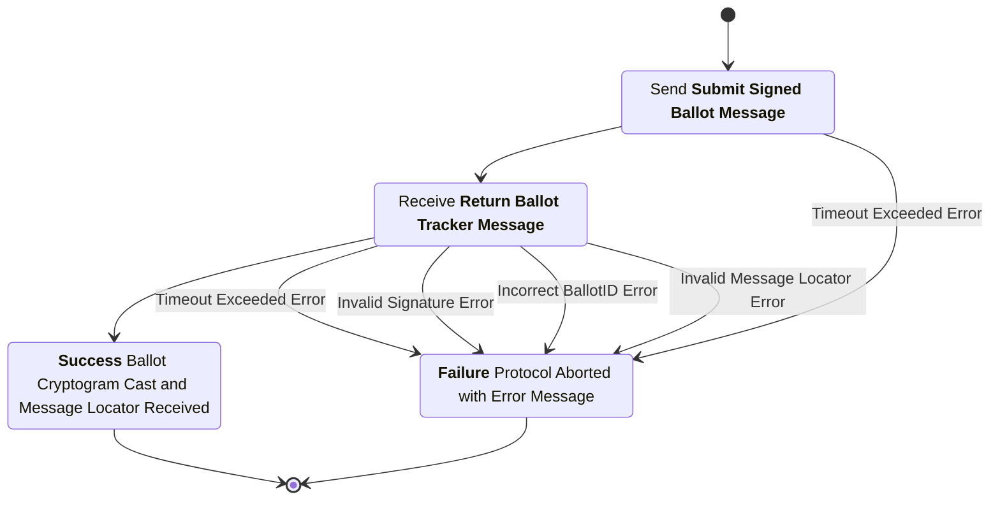
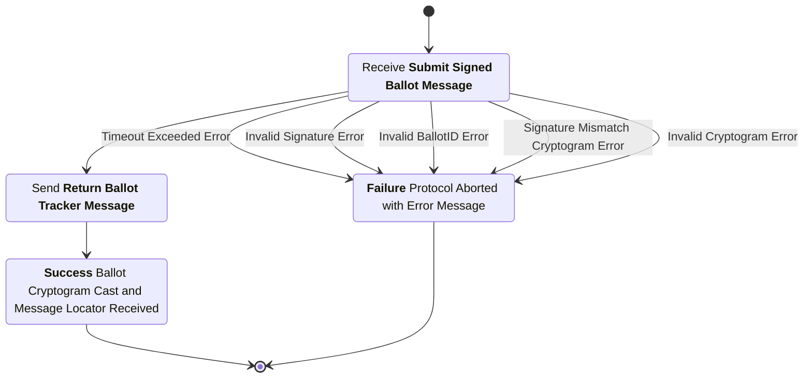

# Ballot Casting Subprotocol

This subprotocol defines the interaction between the voting application and the digital ballot box to mark as cast a previously submitted ballot.

## Phase 1: Request to Cast

### Cast Request Message

sender
: Voting Application (VA)

recipient
: Digital Ballot Box (DBB)

purpose
: Inform the digital ballot box which ballot the voting application is requesting to cast and provide a non-reputable digital attestation that the voting application has requested this action take place.

***structure***

```rust
struct CastReqMsgData {
  election_hash : ElectionHash,
  voter_authorization : VoterAuthorization,
  ballot_tracker : BallotTracker,
}

struct CastReqMsg {
  data : CastReqMsgData,
  signature : Signature,
}
```

- `voter_authorization`: An authorization token, signed by the EAS, containing the hash of the unique election configuration item, the voter's pseudonym (the unique identifier for the voter for the current election), the ballot style they are authorized to vote, and the verifying key associated with this voting session. See the voter authentication specification for more details about this data structure.
- `ballot_tracker`: The unique identifier of the ballot cryptogram to be cast.
- `data`: The data being signed (contains the election hash, voter pseudonym, voter verifying key, and ballot tracker).
- `signature`: A digital signature created over the serialized contents of the `data` field by the voting application's signing key.

### Cast Request Checks

1. The `voter_authorization` is valid.
    1. Its signature verifies with the known EAS signature verification key for the current election.
    2. Its election hash is the hash of the election configuration item for the current election.
    3. Its timestamp is in the past.
2. The `signature` is a valid signature over the serialized contents of the `data` field (it verifies with the verifying key within the `voter_authorization`).
3. The `ballot_tracker` matches a previously published `BallotSubBulletin` entry on the public bulletin board and the `voter_authorization` in this message is identical to the `voter_authorization` in that `BallotSubBulletin` entry.
4. No cast ballot appears on the bulletin board with the voter pseudonym in the `voter_authorization`.
5. The `BallotSubBulletin` corresponding to the `ballot_tracker` is the most recent submitted ballot on the bulletin board with the voter pseudonym in the `voter_authorization`.

### Ballot Cast Bulletin

Once the *Cast Request Checks* have been completed successfully, the casting of the selected ballot can proceed. The digital ballot box appends this entry to the public bulletin board. This entry officially casts the ballot on behalf of the voter for this election. This process can only occur once per voter and cannot be canceled once completed. The casting bulletin serves to permanently record the voter's ballot choices as cast, and the voter's authorization to cast the ballot (included in both the `SignedBallotMsg` and the `CastReqMsg`), using a tamper evident data structure.

***structure***

```rust
struct BallotCastBulletinData {
  election_hash : ElectionHash,
  timestamp : u64,
  ballot : SignedBallotMsg,
  cast_intent : CastReqMsg,
  previous_bb_msg_hash : String,
}

struct BallotCastBulletin {
  data : BallotCastBulletinData,
  signature : String,
}
```

- `election_hash`: The hash of the unique election configuration item.
- `timestamp`: The timestamp of when the DBB processed the submission (Unix timestamp in seconds since epoch).
- `ballot`: The signed ballot message submitted earlier matching the ballot tracker in the cast request.
- `cast_intent`: The signed voter cast request message from the VA.
- `previous_bb_msg_hash`: The hash of the last message posted to the bulletin board.
- `data`: The data being signed (contains the election hash, timestamp, ballot, cast intent, and previous bulletin board message hash).
- `signature`: A digital signature created over the serialized contents of the `data` field by the digital ballot box signing key.

## Phase 2: Confirm Cast

Once the digital ballot box has validated the cast request against the appropriate validation checks and written the cast message to the public bulletin board this phase begins.

### Cast Confirmation Message

sender
: Digital Ballot Box (DBB)

recipient
: Voting Application (VA)

purpose
: Confirm to the voting application that the ballot has been successfully cast and provide the voting application with a locator for the public bulletin board message where the casting message was written.

***structure***

```rust
struct CastConfMsgData {
  election_hash : ElectionHash,
  ballot_sub_tracker : BallotTracker,
  ballot_cast_tracker : Option<BallotTracker>,
  cast_result : (bool, String),
}

struct CastConfMsg {
  data : CastConfMsgData,
  signature : Signature,
}
```

- `election_hash`: The hash of the unique election configuration item.
- `ballot_sub_tracker`: The unique identifier of the submitted ballot bulletin on the PBB.
- `ballot_cast_tracker`: The optional unique identifier of the casting bulletin on the PBB (present only if casting succeeded).
- `cast_result`: A tuple containing a boolean indicating if the cast was successful and a string with result details.
- `data`: The data being signed (contains the election hash, ballot submission tracker, ballot cast tracker, and cast result).
- `signature`: A digital signature created over the serialized contents of the `data` field by the digital ballot box's signing key.

## Voting Application Process Diagram



## Digital Ballot Box Process Diagram


